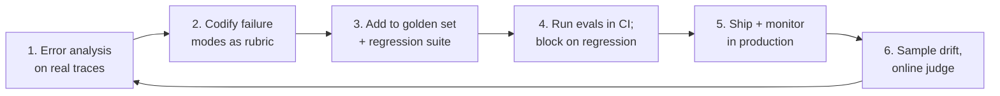
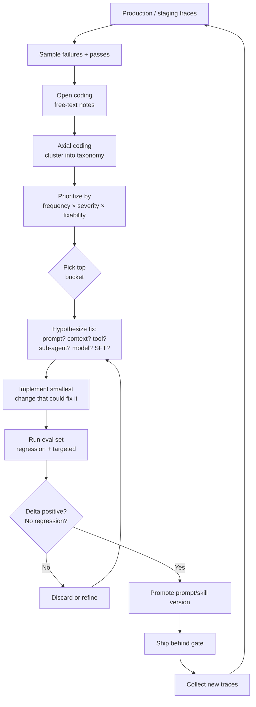
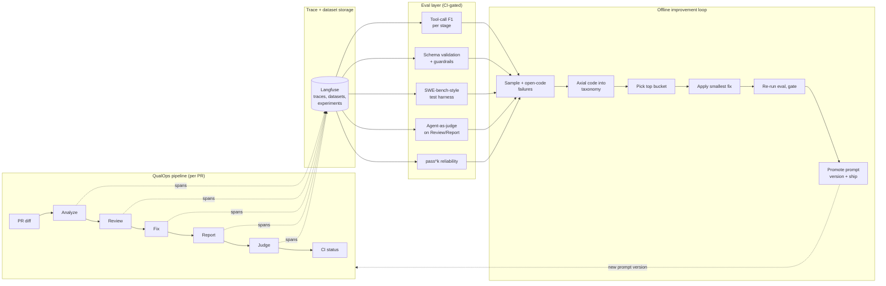
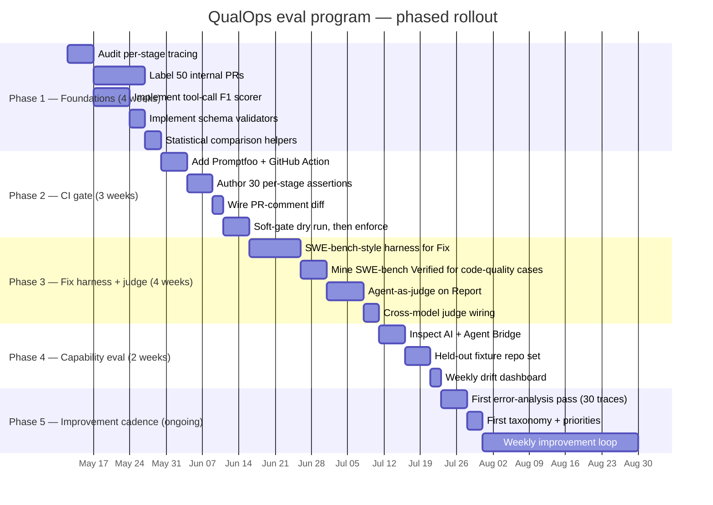

# Evaluating and Improving LLM Agents

**A state-of-the-art report on agent accuracy, evaluations, and offline improvement — with a generalized approach for QualOps and similar projects.**

*QualOps Research · May 8, 2026*

---

## Document map

This report is structured for two audiences. The **executive summary** and **Part 1** (Why this matters) are written for leadership; the rest is written for the engineering team that will implement the eval and improvement program. The **QualOps Approach** in Part 6 is the actionable plan distilled from everything before it. References and a glossary close the document.

| Part | Title | Primary audience |
|---|---|---|
| 0 | Executive summary | Leadership + engineering |
| 1 | Why this matters for QualOps | Leadership |
| 2 | Foundations of agent evaluation | Engineering |
| 3 | Evaluating tool-calling and workflow agents | Engineering |
| 4 | The framework landscape | Engineering |
| 5 | Systematically improving agents (offline) | Engineering |
| 6 | **The QualOps Approach** — generalized concept | Both |
| 7 | Prerequisites and adoption roadmap | Both |
| 8 | Risks, open questions, and what we left out | Both |
| 9 | Appendix: glossary, references, dossier links | Engineering |

---

## 0. Executive summary

LLM agent quality is not a property of the model alone — it is a property of the *system*: the model, the prompts, the tools, the context routing, and the harness, all together. As QualOps has matured into a multi-stage agentic pipeline (Analyze → Review → Fix → Report → Judge), the unit that matters has become the **trajectory** the agent takes through tool calls, not just the final PR comment. Evaluating that trajectory and systematically improving it is now the bottleneck for accuracy, cost, and trust.

The good news: the field has converged on a small, well-supported playbook. We do **not** need to invent it. The shape of the recommendation is:

1. **Score the agent on three layers, every release.** Component-level (did each tool call fire correctly?), trajectory-level (was the path coherent?), outcome-level (did the final report and patch hold up?). Single end-to-end scores hide too much.
2. **Use a small, curated golden set, not a giant crawl.** 50–200 carefully labeled real PRs, refreshed quarterly, beat 10,000 synthetic ones. Anthropic's, Sierra's, and Cognition's published guidance all converge on this.
3. **Apply the right tool to the right stage.** Deterministic tests for the Fix stage (SWE-bench-style "apply patch, run tests"). Tool-call F1 and AST-match for Analyze. LLM-as-judge with structured rubrics for Review and Report. Agent-as-judge for the Judge stage's meta-eval.
4. **Run a two-tier eval cadence.** A fast per-PR gate (~3–5 min, deterministic asserts on each stage) and a slower nightly or weekly capability eval (~30–60 min, full pipeline + LLM judges + paired statistical comparison against a baseline). Both should fail-loud.
5. **Improve through structured error analysis.** Open-coding 30–50 failing traces, axial-coding into a 5–15 bucket taxonomy, and prioritizing by `frequency × severity × fixability` is the single highest-ROI activity in the loop. The next-cheapest fixes — prompt edits, few-shot mining, tool surface cleanup, context engineering — beat fine-tuning in almost every case until the prompt surface is exhausted.
6. **Keep what works and add what is missing.** QualOps already runs Langfuse with datasets, scorers, presets, and LLM-as-judge — that is the right foundation. The two gaps worth filling are (a) a **per-PR CI gate** with developer-friendly diffs (Promptfoo's GitHub Action) and (b) a **nightly capability eval** harness (Inspect AI or hand-rolled with `agentevals` patterns) that scores the full pipeline end-to-end on a held-out fixture set. Migration away from Langfuse is not recommended *unless we discover a specific feature gap* — the marginal UX wins of LangSmith / Braintrust do not justify a closed-source migration today.

If implemented in full, this gives QualOps a release process where every prompt, skill, tool, or model change produces a quantitative, auditable delta against a known baseline — and where regressions are caught before they reach a customer's pull request.

---

## 1. Why this matters for QualOps

### 1.1 What QualOps is

QualOps is an AI-powered code review tool built on the Claude Agent SDK. It runs in CI on every pull request and produces structured findings — comments, GitHub Checks annotations, severity-ranked reports, and (in agentic mode) suggested fixes. The system is organised as a multi-stage pipeline:

```
                 ┌──────────┐    ┌─────────┐    ┌─────┐    ┌────────┐    ┌───────┐
PR diff ───────► │ Analyze  │───►│ Review  │───►│ Fix │───►│ Report │───►│ Judge │───► CI status
                 └──────────┘    └─────────┘    └─────┘    └────────┘    └───────┘
                  detect          per-file       suggest    aggregate     quality
                  changed         findings       patch      + format      gate
                  files                                                   (pass/fail)
```

In agentic mode, sub-agents (security, dependency, breaking-change) operate in parallel within the Review stage, and the Judge stage acts as an internal LLM-as-judge over the final report.

### 1.2 What is at stake

A code review is a **trust artifact**. A false positive — a flagged "vulnerability" that is not real — wastes developer time and erodes confidence in every subsequent finding. A false negative — a missed real bug — defeats the purpose of the tool. A confidently miscalibrated severity label routes attention away from the issues that actually matter. None of these failures are catastrophic individually, but they compound across thousands of PRs.

For a tool that runs in production CI, the consequences of letting accuracy drift quietly are:

- **Customer churn.** Reviewers turn the bot off. Recovering trust is expensive.
- **Hidden regressions.** A prompt change that fixes one issue and silently regresses three others accumulates over months.
- **Cost overruns.** Without per-stage cost-quality measurement, model upgrades produce big bills with unclear value.
- **Audit risk.** Enterprise customers increasingly require evidence that the tool's outputs are validated.

The fix is not "more model" — it is **disciplined evaluation and structured improvement**. The community converged on this consensus through 2024–2026; this report makes it concrete for QualOps.

### 1.3 What we already have

QualOps ships with a working evaluation suite: Langfuse-backed dataset runs, multiple presets (`fast`, `default`, `sonnet-agentic`, `thorough`), CRB-derived golden datasets across five real repos (Sentry, Grafana, Cal.com, Discourse, Keycloak), and a configurable LLM-as-judge scoring stage. This puts QualOps ahead of most teams shipping agentic products today. The gaps we identify in this report are deliberate next steps, not foundations.

### 1.4 What "out of scope" means

The brief that motivated this report explicitly excludes **online self-improvement in production** — RLHF, continuous training, online policy updates. QualOps deploys fixed versions. Improvement happens between releases, on labeled traces, in CI. Everything in this report is consistent with that model.

---

## 2. Foundations of agent evaluation

### 2.1 An agent is not a function

A classical LLM eval treats the model as a function `f(prompt) → completion` and grades the completion against a reference (BLEU, ROUGE, exact match, regex). The unit of evaluation is one input/output pair.

An agent eval treats the agent as a **stateful policy** `π` that interacts with an environment via tools. The unit of evaluation is a **trajectory** — an ordered record of states, actions (tool calls), and observations:

```
τ = (s₀, a₀, o₀, s₁, a₁, o₁, …, sₙ)
```

Every benchmark surveyed for this report agrees: agent evaluation requires assessing not just the terminal answer but the *path* taken to reach it. Anthropic's engineering team frames the same shift as moving from "single-output grading" to "behavior verification across many turns" ([*Demystifying evals for AI agents*](https://www.anthropic.com/engineering/demystifying-evals-for-ai-agents)).

### 2.2 The three layers of agent evaluation

Modern taxonomies (Yu et al. 2025; LangChain documentation; Anthropic engineering) recognize three nested layers of evaluation:

| Layer | Question | Typical metric |
|---|---|---|
| **Component-level** | Does each sub-skill (retriever, single tool call, sub-agent) work in isolation? | Tool-match rate, parameter F1, retrieval recall@k |
| **Trajectory-level** | Is the path of reasoning + actions valid, efficient, and faithful? | Plan correctness, trajectory edit distance, tool-call F1 over the sequence |
| **Outcome / end-to-end** | Did the agent achieve the user goal? | Task success, unit-test pass rate (SWE-bench), human rating |

For QualOps, all three layers exist naturally:

- **Component**: did the Analyze stage `read_file` with the right path? Did the security sub-agent emit a well-formed finding?
- **Trajectory**: did the Review stage's parallel sub-agents converge to a coherent set of findings without redundant tool calls?
- **Outcome**: did the suggested fix actually fix the bug, and did the final report match what a human reviewer would write?

Reporting only the outcome is the most common mistake. An agent can land on a correct PR comment after twelve irrelevant tool calls and faulty reasoning along the way. Outcome metrics miss this.

### 2.3 Dimensions of agent quality

Stanford's HELM framework canonicalized seven core metrics (accuracy, calibration, robustness, fairness, bias, toxicity, efficiency) and showed that accuracy alone hides serious failure modes. For an agentic code-review system, the dimensions that matter most are:

| Dimension | Why it matters for QualOps | How to measure |
|---|---|---|
| **Accuracy / task success** | The headline number. | Exact match, unit-test pass, human rating |
| **Faithfulness / groundedness** | A finding must be supported by an actual line of the diff or repo, never invented. **Dominant for code review.** | Atomic-claim NLI; "every claim must cite a file:line" guardrail |
| **Completeness** | Did the agent find all the issues a human would? | Recall against an annotated PR review |
| **Calibration** | Severity labels must be trustworthy for triage. | Expected calibration error (ECE), Brier score |
| **Robustness** | Stable under prompt perturbation, weird diffs, large files. | Performance under paraphrase/typo/adversarial suites |
| **Determinism / consistency** | Same PR → same review (or stable distribution). | Output variance across N samples; pass^k |
| **Latency** | CI gates have time budgets. | p50/p95/p99 wall-clock per stage |
| **Cost** | $ per PR. | Tokens × price + tool-call costs |
| **Safety** | Should not leak secrets or follow injected instructions in untrusted source. | Red-team pass rate |

Two notes specific to QualOps:

- **Faithfulness is dominant.** A hallucinated finding is more damaging than a missed one because it erodes reviewer trust. The RAG literature's faithfulness method — extract atomic claims, verify each against the source — generalizes directly. Concretely: every claim in the report must cite a file:line; if it cannot, drop the claim. ("Citations as guardrail" is the established pattern.)
- **Calibration matters for triage.** If QualOps emits a severity label, ECE quantifies whether "high" findings are actually higher priority. LLMs are systemically overconfident under verbalized prompting; consistency-based confidence (sample N, measure agreement) is more reliable than asking the model to rate its own confidence.

### 2.4 The evaluation lifecycle

Mature teams converge on a recognizable loop ([Husain](https://hamel.dev/blog/posts/evals/); [Yan et al., O'Reilly](https://www.oreilly.com/radar/what-we-learned-from-a-year-of-building-with-llms-part-i/)):



Tactics endorsed across primary sources:

- **Start small.** Anthropic's engineering team writes that "20–50 simple tasks drawn from real failures is a great start." Simon Willison: "if you're passing 100% of your evals, you're not challenging your system enough."
- **Eval-driven development.** Treat evals like unit tests: write them first, fail them, then build the change that passes them. Every production failure becomes a new eval row.
- **Golden datasets are curated, not crawled.** They should reflect real production distribution, include known failure cases, and cover edge cases discovered in error analysis. For QualOps: 50–200 real PRs spanning languages, sizes, change types, and labeled failure modes.
- **Regression tests on every PR.** Run the eval suite in CI on each prompt or code change. Block merges on stat-sig regression of any axis.
- **Online monitoring** samples production traffic (5–10% is a common heuristic) and runs an LLM-judge fleet asynchronously to flag drift.

### 2.5 LLM-as-judge: the workhorse, with caveats

Zheng et al.'s [*Judging LLM-as-a-Judge with MT-Bench and Chatbot Arena*](https://arxiv.org/abs/2306.05685) (NeurIPS 2023) showed that GPT-4 acting as a judge agreed with human preference at over 80% — roughly the same as inter-human agreement. This legitimized LLM-as-judge as a primary evaluation method, and it is now the workhorse of every eval framework on the market.

The same paper, and a flood of follow-ups, identify recurring failure modes. The biases QualOps must mitigate:

| Bias | What happens | Mitigation |
|---|---|---|
| **Position bias** | Judge prefers whichever answer appears first | Swap order, score both, average |
| **Verbosity bias** | Longer answers rated higher | Constrain length in rubric; normalize |
| **Self-preference** | Judge prefers outputs from its own model family | Use a different model as judge; ensemble across providers |
| **Familiarity / low-perplexity bias** | Judge favors text it would have generated | Down-weight low-perplexity samples |
| **Sycophancy** | Judge follows hints in the prompt about which is "better" | Blind the judge to source |
| **Fallacy oversight** | Judge accepts confident-sounding wrong reasoning | Require step-by-step grading; use process supervision |

Hamel Husain's *Using LLM-as-a-Judge* guide recommends **binary pass/fail rubrics** over Likert scales for production judges, because binary judges are easier to calibrate against humans and easier to debug. For open-ended quality grading (e.g. "is this PR comment helpful?"), pairwise comparison with order-swapping outperforms pointwise scoring.

#### When LLM-as-judge fails

Eugene Yan's survey of two dozen judge papers ([eugeneyan.com](https://eugeneyan.com/writing/llm-evaluators/)) flags cases where LLM-judge is unreliable:

- Tasks requiring deep domain expertise the judge lacks.
- Tasks where the judge would have to do work harder than the generator (judging a math proof when the judge cannot do the math).
- Highly subjective tasks where humans disagree among themselves.

For these cases, three escalation paths exist: **process reward models** (PRMs) that score each reasoning step; **agent-as-judge** that gives the judge tool access to verify claims; and **periodic human review** of a calibration sample. We use all three at appropriate points in the QualOps Approach (Part 6).

### 2.6 Trajectory and process evaluation

A code-review agent can produce a correct final report by accident — having issued ten irrelevant tool calls and reasoned incorrectly along the way. Outcome metrics miss this. Process evaluation asks: *was every intermediate step justified?*

Three families of techniques exist:

- **Step-wise correctness.** Score each step on (a) whether the tool was appropriate, (b) whether the arguments were valid, (c) whether the output was used. Aggregating gives a step success rate.
- **Plan-level metrics.** Treat the reference trajectory as a set or multiset of expected steps. Compute precision = |predicted ∩ reference| / |predicted|, recall = |predicted ∩ reference| / |reference|, F1.
- **Edit distance.** Treat both trajectories as strings of tool tokens; Levenshtein distance, optionally weighted by argument similarity. Continuous score.

OpenAI's *Let's Verify Step by Step* (Lightman et al. 2023) showed that **process supervision** beats outcome supervision for training reward models on math; the methodology has since been extended to reasoning PRMs (R-PRM, ThinkPRM) and to coding agents. For QualOps, the directly applicable lesson is: **score the trajectory, not just the final report.**

### 2.7 Statistical rigor — why "vibes" fail

With N=10 examples and a stochastic model, a swing of ±20% in pass rate is normal noise. Most teams operate at this scale and overclaim improvements that are within the noise floor. The minimum statistical discipline:

- **Paired comparisons.** Run model A and model B on the *same* set of examples; the per-example difference cancels per-example variance. McNemar's test for binary outcomes; paired bootstrap for any metric.
- **Confidence intervals.** For binary pass/fail with sample mean p and N samples, the 95% CI half-width is roughly `1.96 × sqrt(p(1-p)/N)`. To distinguish 80% from 85% accuracy at 95% confidence you need ~1000 samples — and most teams have far fewer. This is why **paired** matters.
- **Multiple runs per task.** Even at temperature 0, modern serving stacks are non-deterministic (batched inference, kernel non-determinism). Plan for ≥5 runs per task and report mean ± std.
- **pass^k reporting.** Sierra's τ-bench introduced the *probability of succeeding k times in a row* as the reliability metric. For QualOps it answers a real question: "is this prompt change reliable enough to deploy?"
- **Bradley-Terry / Elo for pairwise rankings.** When the metric is "which model wins this pair?", fit a latent skill rating per model; resample pairs with bootstrap to get CIs on each rating. This is what Chatbot Arena does.

Anthropic's [*A Statistical Approach to Model Evals*](https://www.anthropic.com/research/statistical-approach-to-model-evals) is the most accessible engineer-facing walkthrough of these techniques.

### 2.8 Recent academic directions worth knowing

- **Process reward models (PRMs)** — beyond math, PRMs are now applied to coding agents and multi-step retrieval. The trend is from discriminative classifiers toward **generative / reasoning PRMs** that produce a rationale before scoring.
- **Self-consistency, self-refinement, debate** — sampling multiple reasoning paths and majority-voting; agents critiquing and revising their own output; multi-agent debate as scalable oversight.
- **Constitutional methods** — written rubrics the model uses to critique and revise its own outputs (RLAIF). Useful for *evaluation* too: the constitution doubles as a rubric.
- **Agent-as-judge** — the newest frontier. Rather than a static LLM judge, the judge is an *agent* with tools who can re-read the source, run tests, and verify intermediate steps. Zhuge et al. 2024 ("Agent-as-a-Judge") report ~90% human agreement and ~97% cost reduction vs. human evaluation. **This is directly relevant to QualOps**: the existing Judge stage already smells like agent-as-judge applied internally.

---

## 3. Evaluating tool-calling and workflow agents

QualOps is a **tool-calling workflow agent**, not a chatbot. Conversational eval techniques (turn-level helpfulness, persona consistency) are largely irrelevant. What matters is whether the agent picks the right tools, in the right order, with the right arguments, and produces the right final artifact. This part summarizes the techniques that map cleanly onto QualOps's pipeline.

### 3.1 What "tool-call accuracy" actually means

"Tool-call accuracy" is a deceptively flat label. In practice it decomposes into a stack of sub-metrics, each measuring a different failure mode:

- **Exact match** — predicted call equals gold call byte-for-byte. Brittle: `{"path": "src/foo.py"}` vs `{"path": "./src/foo.py"}` are equivalent but exact-match scores them as wrong.
- **AST match** (the BFCL standard) — parse the call into name + (arg-name, arg-value) pairs and match structurally. Argument-order independent, basic format normalization.
- **Semantic match** — an LLM judge or custom equality function decides whether two argument values are functionally identical.
- **Argument F1** — per-call precision/recall on argument names and values. Distinguishes "wrong tool" from "right tool, wrong argument."
- **Tool-call F1** (set-level) — over a multiset of (tool, args) pairs across the trajectory.
- **Multi-call ordering** — exact match, in-order subsequence, any-order set, or edit distance.
- **Hallucinated tools** — the agent invents a tool that doesn't exist or arguments that don't apply. BFCL has a dedicated *irrelevance* category.
- **Missed tools** — the agent answered from its own (often outdated) knowledge instead of calling the available tool. Recall is the natural metric. Production teams flag under-tooling as one of the top failure modes.
- **Idempotency / collateral damage** — a side-effecting call (post comment, write file) was issued multiple times, or a tool was called that mutated unintended state. AppWorld's eval explicitly penalizes collateral damage.
- **Parallel calls** — agents (Claude in particular) can emit multiple tool calls in one turn. Scorers must handle a *bag* of tool calls per turn, not a list.

For QualOps these manifest stage by stage:

| Stage | Most relevant tool-call metric |
|---|---|
| Analyze | Tool-call F1 against expected `read_file` / `grep` set; under-tooling rate |
| Review | Argument F1 on finding location (file, line range); hallucinated-tool detection |
| Fix | AST match on patch primitives; idempotency check on `apply_patch` |
| Report | Schema validation; structured-output conformance |
| Judge | Argument F1 on severity labels; calibration vs human gold |

### 3.2 Trajectory and plan evaluation

A trajectory is the ordered record of (action, observation) pairs. Evaluating it answers two distinct questions:

- **Q1 — Did the agent get to the goal?** (outcome, goal-completion)
- **Q2 — Did it follow a sensible path?** (process, plan quality)

These are orthogonal: an agent can stumble to the right answer through a 47-step random walk, or it can take an optimal 3-step path that ends in the wrong final state. Scoring rules in increasing leniency:

```
trajectory exact match    < in-order match    < any-order match    < edit distance
[strictest]                                                              [most lenient]
```

The Sierra / τ-bench position is explicit: in production they care primarily about **goal database state** — they compare the post-conversation DB to an annotated goal DB. Cursor's `CursorBench` flips this: they care about path quality (code style, efficiency, interaction) too because users *experience* the path.

For QualOps the recommendation is **hybrid**: outcome at the gate (Fix patch must pass tests; final Report must validate schema), plus per-stage trajectory metrics for diagnostics and ranking when outcomes are roughly equal.

### 3.3 Outcome vs. process — when to use each

| Aspect | Outcome eval | Process eval |
|---|---|---|
| Data needed | A goal-state checker (unit test, schema, regex) | Reference trajectories (expensive) or judge model |
| Cost | Cheap, deterministic | Expensive or noisy |
| Catches "lucky shortcuts" | No — agent can game it | Yes |
| Catches plan inefficiency | No | Yes |
| Penalizes equivalent-but-different paths | No (good) | Yes (bad — risks rewarding rote imitation) |

Pitfalls of pure outcome:

- **Reward hacking via lucky shortcut.** An agent finds a single-line trick that passes the FAIL_TO_PASS test but doesn't actually fix the bug class. SWE-bench Verified mitigates this by also requiring PASS_TO_PASS.
- **Spec ambiguity.** OpenAI annotators rejected ~30% of original SWE-bench instances for ambiguous specs or wrong test patches when building Verified.
- **Non-reproducibility.** Stochastic tools make the goal state non-deterministic.

Pitfalls of pure process:

- **Path rigidity** — penalizing a faster, equivalent path. Anthropic's eval blog calls this out as the most common pitfall they see.
- **Reference-trajectory bias** — human authors write idealized trajectories that don't reflect how an LLM actually thinks; comparing against them rewards mimicry over capability.

### 3.4 Major benchmarks worth knowing for QualOps

QualOps will not adopt these benchmarks wholesale, but their **methodologies** transfer directly. The most relevant ones:

| Benchmark | Year | Why it matters for QualOps |
|---|---|---|
| **BFCL v3** ([leaderboard](https://gorilla.cs.berkeley.edu/leaderboard.html)) | 2024 | AST match + executable accuracy methodology; the right framework for scoring per-stage tool calls. |
| **τ-bench** ([Sierra](https://sierra.ai/blog/benchmarking-ai-agents)) | 2024 | pass^k metric for reliability under non-determinism. Directly transferable. |
| **SWE-bench Verified** ([swebench.com](https://www.swebench.com/verified.html))† | 2024 | Apply patch + FAIL_TO_PASS + PASS_TO_PASS test harness. *The* template for evaluating QualOps's Fix stage. |
| **SWE-bench Live** ([swe-bench-live](https://swe-bench-live.github.io/)) | 2025 | 50 freshly verified GitHub issues per month. Contamination-free source of code-review test cases. **Now the recommended SWE-bench variant** for fresh, uncontaminated cases. |
| **SWE-bench Pro** ([Scale AI](https://github.com/scaleapi/SWE-bench_Pro-os)) | 2025 | Long-horizon, enterprise-scale. GPT-5 23.3% / Claude Opus 4.1 23.1% — i.e. enterprise-scale code-agent tasks remain hard. |
| **AppWorld** ([appworld.dev](https://appworld.dev/)) | 2024 | State-based eval with collateral-damage check. The model for any side-effecting QualOps action. |
| **DevAI / Agent-as-a-Judge** ([repo](https://github.com/metauto-ai/agent-as-a-judge)) | 2024 | Methodology for using an agent (with tools) as the judge. Maps to QualOps's Judge stage. |
| **TRAJECT-Bench** | 2025 | Trajectory-quality metrics over outcomes. |
| **Holistic Agent Leaderboard** ([HAL](https://arxiv.org/pdf/2510.11977)) | 2025 | Variance-decomposed reporting; good model for our internal dashboards. |

The single most influential idea for QualOps is **SWE-bench's "tests as oracle"**: apply the agent's patch, run FAIL_TO_PASS + PASS_TO_PASS, classify. Fully deterministic, fully outcome-based, ignores how the agent got there, resists most reward hacking. We adopt the *methodology* directly for the Fix stage in Part 6.

> **† Note on SWE-bench Verified status (May 2026):** OpenAI publicly deprecated SWE-bench Verified on Feb 23, 2026, citing flawed test patches and contamination concerns. The benchmark's *methodology* (apply patch, run FAIL_TO_PASS + PASS_TO_PASS) remains the gold standard for code-agent evaluation, but for a fresh, contamination-free dataset prefer **SWE-bench Live** (50 newly-verified issues per month) or **SWE-bench Pro**. Internal harnesses built on the methodology are unaffected; only the specific 500-instance frozen dataset is no longer recommended as a leaderboard target.

### 3.5 Code-agent specific evaluation

For QualOps's Review stage (no patch, just a comment), the analog of SWE-bench's pattern is:

1. **Finding location precision/recall** — did the agent flag the right line and file?
2. **Finding-class match** — did it categorize correctly (security vs perf vs style)?
3. **Finding–PR alignment** — does the finding correspond to something the human reviewer also flagged?

Test execution is the gold-standard oracle, but tests don't catch every flavor of bad fix:

- **Style / readability regression** — tests pass, but the diff is ugly, over-broad, or violates project conventions.
- **Performance regression** — tests pass but quietly add an O(n²).
- **Security regression** — tests pass but the patch introduces a new vuln.

These need additional graders: linter / formatter delta, perf benchmark, CodeQL/Semgrep diff, LLM-judge with explicit criteria. Cursor's CursorBench explicitly grades "code quality" and "efficiency" alongside correctness for this reason.

### 3.6 Agent-as-judge

The newest frontier. Zhuge et al.'s [*Agent-as-a-Judge*](https://arxiv.org/abs/2410.10934) (Oct 2024; ICML 2025) replaces the LLM judge with an *agent* judge that can read code, run tools, and verify intermediate steps. They release **DevAI**, 55 AI-dev tasks with 365 hierarchical requirements, and report:

- ~90% agreement with human expert (vs ~70% for plain LLM-judge).
- ~97% cost reduction (86 h / $1,297 → ~2 h / $31).

Works well when:

- The artifact is open-ended (no unit tests possible) — "is this PR comment helpful and accurate?"
- Evaluation requires looking at intermediate steps — "did the agent actually verify this finding by reading the file, or hallucinate it?"
- You have a structured rubric the judge can iterate over.

Doesn't help when:

- The judge shares the candidate's biases (same model family — self-preference).
- Stakes require human sign-off anyway.
- A simple deterministic check exists.

For QualOps: an *external* agent-as-judge is well suited to grading "was this PR review good?" — give it the diff, the agent's findings, the actual human-merged PR, and a rubric, and let it use grep/file-read tools to verify each finding against the code. This is one of the most directly applicable techniques in the literature. Crucially, run the judge on a **different model family** than the Review stage to avoid self-preference.

### 3.7 Replay testing and recorded traces

Pattern (used by Braintrust, LangSmith, Arize Phoenix, Anthropic, Cognition):

1. Capture every production run as a trace (inputs, all tool calls, all outputs, final artifact).
2. Tag interesting traces — failures, edge cases, customer escalations — into a regression set.
3. On every prompt / model / harness change, replay each trace: feed the same input, *but stub tool calls with the recorded outputs*, and observe whether the agent makes equivalent decisions.
4. Diff: were tool-call sequences equivalent? Did the final artifact differ?

For QualOps: every PR review you ship is already a trajectory. Sample some, freeze them, and you have a regression suite that tracks model and prompt drift better than any synthetic benchmark. AgentRR (arXiv 2505.17716) formalizes the pattern.

### 3.8 Decision guide: situation → technique

| Situation | Use this technique |
|---|---|
| Single-call function selection | BFCL-style **AST match** + **argument F1** |
| Multi-step deterministic workflow | **Trajectory in-order match** + **state-based eval** |
| Parallel tool calls in one turn | **Set-equality** match (bag of calls) |
| Tool arguments are free-form text | **Action similarity** (embedding or LLM-judge) |
| Side-effecting tools | **State-based eval with collateral-damage check** |
| Output is a code patch | **SWE-bench harness**: apply patch + FAIL_TO_PASS + PASS_TO_PASS |
| Output is open-ended text | **Agent-as-judge** with structured rubric |
| Detect hallucinated tools | **Schema validation** + tool-name whitelist |
| Detect missed tools | **Recall** against reference trajectory |
| Variance/reliability | **pass^k** with k≥5; report mean + 95% CI |
| Catching prompt/model regressions | **Recorded-trace replay** with tool stubs |
| Long-horizon multi-stage agent (QualOps) | **Hybrid**: per-stage tool-call F1 + per-stage state checks + end-to-end outcome + agent-as-judge on final report |

---

## 4. The framework landscape

The eval / observability tooling ecosystem moved fast through 2025–2026. The major shifts since early 2025: **OpenAI acquired Promptfoo in March 2026** (MIT license preserved), **Langfuse landed observation-level LLM-as-judge** in February 2026, the **Claude Agent SDK** (formerly Claude Code SDK) became the default Anthropic agent harness, and **Inspect AI** (UK AISI) reached production-grade adoption inside frontier labs. The recommendations below reflect the May 2026 state.

### 4.1 The shortlist for QualOps

For a small team running CI-gated tool-calling agents in a Node/TS codebase already on Langfuse, five tools matter:

1. **Langfuse** *(incumbent — keep)*. MIT, self-host, observation-level LLM-as-judge (Feb 2026), boolean/categorical scoring. Production references include Canva. Strong TS + Python parity.
2. **Promptfoo** *(add as CI gate)*. MIT, OpenAI-acquired but license preserved, first-class GitHub Action with PR-comment diffs, Claude Agent SDK provider. Lowest-effort per-PR gating in the space.
3. **Inspect AI** *(add for nightly capability evals)*. MIT, used internally by Anthropic, DeepMind, Grok. Agent Bridge wraps the QualOps agent without modifying it. Python-only is fine for nightly.
4. **LangSmith** *(only if a wall is hit)*. Best out-of-the-box trajectory primitives via `agentevals`. Closed-source; per-trace pricing penalizes verbose agentic apps.
5. **Braintrust** *(only if non-engineers must contribute test cases)*. Notion's reference deployment is real; the diff UI is polished. Closed-source; hybrid-only self-host.

We deliberately exclude DeepEval, RAGAS, OpenAI Evals API, Phoenix, W&B Weave, MLflow, Patronus, AgentOps, Helicone, and LangWatch from the shortlist for QualOps's profile — not because they are bad, but because they don't out-perform the shortlist on the dimensions that matter to a small TS/Node team in CI on Claude. The full landscape is in `sources/02-frameworks.md`.

### 4.2 Comparison matrix

Legend: ✓ = yes / strong, ≈ = partial / caveat, ✗ = no / weak.

| Framework | OSS | Self-host | Trajectory eval | Tool-call scoring | LLM-judge built in | Online prod eval | CI integration | TS-native | Py-native | Free tier |
|---|---|---|---|---|---|---|---|---|---|---|
| **Langfuse** | ✓ MIT | ✓ free | ≈ DIY | ✓ (Feb 26 obs-level) | ✓ | ✓ | ✓ | ✓ | ✓ | ✓ 50k units/mo |
| **LangSmith** | ✗ | ✓ Plus+ | ✓ `agentevals` | ✓ | ✓ 30+ templates | ✓ | ✓ | ✓ | ✓ | ✓ 5k traces/mo |
| **DeepEval / Confident AI** | ✓ Apache | ≈ lib only | ✓ (Py) | ✓ ToolCorrectness | ✓ G-Eval, DAG | ✓ (CAI) | ✓ pytest | ≈ thin | ✓ | ✓ |
| **Braintrust** | ✗ | ≈ enterprise | ≈ DIY | ✓ in UI | ✓ | ✓ | ✓ Action | ✓ | ✓ | ✓ 1M spans/mo |
| **OpenAI Evals API** | ✓ repo | ≈ | ≈ DIY | ≈ DIY | ✓ model graders | ≈ | ≈ | ≈ via SDK | ✓ | ≈ paid API |
| **Anthropic Console** | ≈ SDK | ✗ | ✗ | ✗ inspect only | ✗ | ✗ | ✗ | ✓ | ✓ | with API |
| **Phoenix / Arize AX** | ✓ Apache | ✓ | ≈ DIY | ✓ OpenInference | ✓ | ✓ AX | ✓ | ✓ | ✓ | ✓ |
| **W&B Weave** | ✓ SDK | ≈ enterprise | ≈ | ≈ | ✓ | ≈ | ✓ | ≈ | ✓ | ✓ |
| **MLflow GenAI** | ✓ Apache | ✓ | ≈ | ≈ | ✓ | ✓ | ✓ | ✗ | ✓ | ✓ |
| **Promptfoo** | ✓ MIT | ✓ | ≈ custom | ≈ Claude SDK | ✓ llm-rubric | ✗ | ✓ best-in-class | ✓ | ✓ | ✓ |
| **Inspect AI** | ✓ MIT | ✓ | ✓ sandbox | ✓ MCP, built-in | ✓ | ✗ | ≈ custom | ✗ | ✓ | ✓ |
| **Patronus** | ✗ | ✗ | ✗ judge only | ≈ | ✓ specialized | ✓ | ≈ | ✓ | ✓ | sales |

### 4.3 What each fits

| Team profile | Recommended primary | Add-ons |
|---|---|---|
| **Small team, CI-gated, Node/TS, Claude (= QualOps)** | **Langfuse** | + Promptfoo (CI) + Inspect AI (nightly) |
| Small/mid team, Python-only, RAG-heavy | DeepEval + RAGAS | + Phoenix or Langfuse |
| Large org, many agents, dedicated SREs | Braintrust (product) + Phoenix/Arize AX (platform) | — |
| LangChain / LangGraph shop | LangSmith | — |
| Frontier-lab / safety org | Inspect AI | + custom storage |
| OpenAI-only shop | OpenAI Evals API + Promptfoo | — |
| Already on W&B for ML | W&B Weave | + RAGAS / DeepEval metrics |

### 4.4 CI integration patterns

The cleanest CI pattern for QualOps is **two-tier**:

1. **Per-PR (fast tier, ~3–5 min)** — Promptfoo YAML with ~30 small assertions on the output of each pipeline stage; runs as a required GitHub check. Posts a PR comment with the diff vs. main.
2. **Nightly / weekly (slow tier, ~30–60 min)** — Langfuse experiment over a 100–200 item dataset, running the full pipeline, with LLM-as-judge scorers on the final report and tool-call F1 scorers on each stage. Plus a quarterly **Inspect AI** capability eval against held-out fixture repos.

This gives developers fast PR feedback and the team a slower, deeper truth.

### 4.5 Real-world reference deployments

- **Canva** — Langfuse production reference for AI design features.
- **Notion** — Braintrust deployment, 70 AI engineers, 10× increase in caught issues per day going from JSONL files to Braintrust workflows.
- **Stripe, Vercel, Zapier, Airtable** — Braintrust customers per their marketing.
- **Etsy, Gamma** — Patronus AI case studies for multimodal LLM-judge.
- **Anthropic, DeepMind, Grok** — Inspect AI users (per UK AISI announcement and Hamel Husain's notes).
- **OpenAI and Anthropic** — both ship Promptfoo as part of their internal eval pipelines (per Promptfoo's GitHub README).

---

## 5. Systematically improving agents (offline)

Once an evaluation harness exists, the bottleneck for agent quality is not "more model" — it is the **discipline of systematic improvement**. Out of scope for QualOps: online RLHF or continuous self-tuning in production. In scope: structured offline iteration between releases.

### 5.1 The eval-driven improvement loop



Four properties worth preserving:

1. **Failures are routed back to the eval set**, not just fixed. Otherwise the regression suite never grows.
2. **Hypothesis is logged separately from the diff.** "I changed the system prompt because X" matters when the next eval shows a regression six weeks later.
3. **One change at a time.** Multi-variate changes invalidate the delta and stall debugging.
4. **The eval set is versioned with the code.** A passing score on v3 of the eval against v3 of the prompt is the only meaningful claim.

### 5.2 Error analysis: open coding → axial coding → frequency

The single most cited improvement technique in the modern eval literature. The method, popularized by Hamel Husain, Eugene Yan, and Shreya Shankar, borrows from grounded-theory qualitative research:

- **Pass 1 — Open coding (bottom-up).** Sit with raw traces. For each failed example (and a sample of passing), write a free-text note describing what went wrong. Critically, do not pre-define categories. Hamel emphasizes that top-down taxonomies — "this is a hallucination", "this is a refusal" — bias annotators toward generic ML categories that miss domain-specific failure modes. Bottom-up coding at NurtureBoss surfaced "date handling" as the dominant failure class and lifted that subtask from 33% to 95% accuracy.
- **Pass 2 — Axial coding.** Group the open-coded notes into a small set of error categories ("axes"). LLM-assisted clustering pass over the notes, then human review of the proposed taxonomy. Output: an error taxonomy of typically 5–15 categories with frequency counts.
- **Frequency-weighted prioritization.** Rank by `frequency × business cost × fixability`. Spend engineering effort top-down. The classic mistake is fixing rare-but-vivid failures because they are easier to remember.

A QualOps-shaped taxonomy might look like:

| ID | Category | Stage | Frequency | Severity | Fixability | Priority |
|---|---|---|---|---|---|---|
| E1 | False positive on idiomatic style | Review | 32% | Low | High | P1 |
| E2 | Missed null-deref across files | Analyze | 18% | High | Medium | P1 |
| E3 | Fix proposed wrong import | Fix | 11% | Medium | High | P2 |
| E4 | Judge rated harmless nit as "blocker" | Judge | 9% | Medium | High | P2 |
| E5 | Refused on large diff | Analyze | 4% | High | Low | P3 |

Each row produces (a) a deterministic regression test, (b) a candidate fix hypothesis, (c) optionally an eval-set sample addition.

### 5.3 The hierarchy of fixes

When a bucket is picked, work the cheapest plausible fix first:

```mermaid
flowchart TD
    Start([Eval reveals failure]) --> Q1{What's the<br/>error type?}

    Q1 -->|Format / schema<br/>violation| F1[Tighten output format<br/>in prompt; add example]
    Q1 -->|Misunderstood<br/>instruction| F2[Restructure prompt:<br/>role/task/format/guardrails]
    Q1 -->|Missing domain<br/>knowledge| F3[Add Skill or<br/>retrieval tool]
    Q1 -->|Hallucinated<br/>fact / API| F4[Add citation requirement<br/>+ retrieval tool]
    Q1 -->|Wrong tool used /<br/>tool confusion| F5[Tool design: names,<br/>descriptions, consolidate]
    Q1 -->|Tool returned ok,<br/>agent ignored result| F6[Tool description +<br/>output summarization]
    Q1 -->|Reasoning chain broke| F7[Extended thinking<br/>or sub-agent split]
    Q1 -->|Style / over-flagging| F8[Few-shot mining:<br/>contrastive don't-flag]
    Q1 -->|Cross-file blindness| F9[Code-graph tool;<br/>orchestrator-worker]
    Q1 -->|Long-context recall| F10[Context engineering:<br/>prune, dynamic load]
    Q1 -->|Judge miscalibrated| F11[Refresh judge<br/>calibration; verifier model]
    Q1 -->|Plateau across many<br/>error types| F12[Prompt optimizer<br/>DSPy / AdalFlow]
    Q1 -->|Latency/cost plateau| F13[Routing or<br/>distillation SFT]
    Q1 -->|Persistent + structured<br/>+ many examples| F14[DPO from preference<br/>pairs; otherwise SFT]
```



The order of operations in 2026, from cheapest to most expensive, is:

1. Better prompt structure / restructure.
2. Better few-shot examples (especially contrastive negatives).
3. Better tools / context / Skills.
4. Sub-agent decomposition.
5. Automated prompt optimization (DSPy/MIPROv2 or AdalFlow).
6. Routing or model swap.
7. Distillation SFT or DPO from preference pairs.

The vast majority of agent-quality wins come before fine-tuning is required.

### 5.4 Prompt engineering as iteration discipline

The era of "prompt is whatever string is in `messages[0]`" is over. Anthropic's own guides for Claude 4.x ("Prompting best practices", "Effective context engineering for AI agents") and OpenAI's GPT-5 prompt cookbook converge on the same skeleton:

```
[Role]      You are <persona, scope>.
[Task]      Goal in 1–2 sentences.
[Context]   Static background, dynamic retrieval, tool surface.
[Examples]  Few-shot, ideally diverse and including hard cases.
[Format]    Output schema (XML / JSON / markdown sections).
[Guardrails] Out-of-scope behaviors, refusal triggers, escalation.
```

For Claude specifically: XML-tag structuring (`<example>`, `<context>`, `<task>`), tool definitions in the system message, instructions in the user turn, "think step by step" or extended thinking for multi-stage tasks.

**Prompt-as-code** principles:

- Prompts live in the repo, not a UI. Every change is a PR.
- Each prompt version gets a content hash; logs reference it.
- Promotion gates: dev → staging → prod, with eval thresholds at each boundary.
- Full execution context is versioned: prompt + model + temperature + tool list + retrieval config. A prompt that worked on Sonnet 4.0 may regress on 4.7.
- Two-axis A/B: by prompt version and by traffic slice.

### 5.5 Automated prompt optimization

A menu, not a stack — pick what fits the stage:

| Tool | Mechanism | When it shines | When it fails |
|---|---|---|---|
| **APE** (2022) | LLM proposes candidates, scored on held-out set | Single-step tasks, clear metric | Multi-stage agents; metric noise |
| **OPRO** (2023) | LLM shown previous prompts + scores, asked to write a better one | Math / reasoning, binary metric | Long prompts; tool-using agents |
| **Promptbreeder** (2023) | Evolutionary, mutates task prompts AND mutation prompts | Cheap, plentiful evals | Cost; doesn't optimize tool use |
| **DSPy / MIPROv2** (2024) | "Programs not prompts": joint optimization of instructions + few-shot via Bayesian search | Multi-stage pipelines (perfect for QualOps) | Requires writing pipeline in DSPy idioms |
| **TextGrad** (2024) | "Backpropagation through text": LLM-generated textual feedback as gradient | Composable systems with critic-able output | Setting up textual loss; cost |
| **AdalFlow** (2024) | PyTorch-style auto-diff over LLM workflows; combines TextGrad + DSPy bootstrapping | Single library covering both directions | Newer, smaller community than DSPy |
| **SAMMO** (Microsoft 2024) | Structural mutation operators over function-graph prompts | Long structured prompts (manuals, policies) | Tasks needing example mining more than surgery |

Practical guidance for QualOps:

- For the **Review** and **Judge** stages — both narrow, scorable on labeled PRs — DSPy/MIPROv2 is the best fit.
- For the **Fix** stage, where the output is code and "correctness" requires running tests, AdalFlow + TextGrad-style textual feedback over `tests pass / fail / lint` is the better mental model.
- All of these need a *cheap, fast metric*. Build it before reaching for an optimizer.

### 5.6 Few-shot mining: the under-used lever

Three lessons from the 2024–25 literature:

1. **Quality dominates quantity.** A handful of well-chosen demonstrations beat dozens of mediocre ones. A single noisy example can reduce accuracy.
2. **Diversity matters more than similarity.** Three near-duplicates teach less than three diverse, on-topic examples.
3. **Dynamic retrieval > static set** for heterogeneous inputs.

Mining recipe for QualOps:

1. Take the labeled error taxonomy from §5.2.
2. For each high-priority bucket, sample 2–3 *clean* fixed examples — input PR, ideal review comments, ideal Fix output. These become "canonical" few-shots.
3. Build a vector index over these examples keyed by diff features (language, file types, lines changed, presence of tests).
4. At inference, retrieve top-k examples and inject them.
5. **Add contrastive examples**: pairs of `(borderline diff, correct minimal review)` so the agent learns where to *not* comment. Code-review agents over-flag by default; contrastive negatives are the cure.
6. Recompute the index when the eval set grows.

### 5.7 Tool design: the most under-appreciated lever

Anthropic's *Writing tools for agents* is the canonical reference. The highlights:

- **Naming**: namespace by service (`github_list_prs`, not `list_prs`); verb_object form.
- **Description is a prompt.** It is read by the model on every call. Explicit about *when* to use, what inputs are valid, what outputs to expect, what the tool will NOT do.
- **Schema with examples.** For complex inputs, an `input_examples` field beats prose.
- **Consolidate, don't proliferate.** Fewer, more capable tools beat many narrow ones. A `code_search(query, kind)` is better than four `find_function`, `find_class`, `find_import`, `find_callsite` tools — the model gets confused choosing among overlapping options.
- **Return high-signal text.** Stable identifiers beat opaque internal IDs. Pruned/summarized output beats firehose dumps; agents pay tokens to read tool returns.
- **Error messages are pedagogy.** "Error 422" teaches the agent nothing. "Error: file path must be relative to repo root; you passed an absolute path; try `src/foo.py`." enables self-correction.
- **Observable side effects.** If a tool mutates state, return the new state in the response.

A QualOps tool-surface audit checklist:

- [ ] Each tool's description has "use this when" and "do NOT use this when".
- [ ] No two tools overlap without explicit disambiguation.
- [ ] Error returns are actionable text, not numeric codes.
- [ ] Tool count per stage ≤ 7 (the empirical comfort zone for Claude Sonnet/Opus).
- [ ] Long outputs are paginated, not truncated mid-token.
- [ ] One canonical "search the code graph" tool, not five.

### 5.8 Context engineering: curate, don't accumulate

"Context engineering is the delicate art and science of filling the context window with just the right information for the next step" — Andrej Karpathy.

The big findings:

- **Context rot.** Recall and reasoning degrade as token count grows, well before the nominal limit. Larger context windows are not free.
- **Lost-in-the-middle** (Liu et al., Stanford). Performance is U-shaped: instructions at the very start or very end win; buried middle loses. Critical guardrails should be at one of the ends.
- **Instruction hierarchy.** When system, user, and tool-output instructions conflict, models tend to follow the most recent and most concretely worded. Conflict-free design beats stacking.

Tactics:

- **Curate, don't accumulate.** Strip stale tool outputs, archived plans, unused docs.
- **Dynamic instruction loading** (= Skills): inject language-specific or domain-specific rules only when the input matches.
- **Retrieval beats stuffing.** A 2K-token retrieved excerpt of the right file beats a 50K dump.
- **Plan persistence.** Long agent runs benefit from an explicit `plan.md`-style scratchpad refreshed each turn.

For QualOps: never feed the entire repo. Feed (a) the diff, (b) the immediate symbol context (callers/callees of touched symbols), (c) project conventions for the relevant language, and nothing else. Add a tool the agent can call when it needs more.

### 5.9 Sub-agent decomposition and Skills

Anthropic's *Building Effective Agents* defines the patterns to reach for *before* assuming a fully autonomous agent is needed:

- **Prompt chaining** — fixed pipeline of LLM calls. (QualOps's Analyze → Review → Fix → Report is one.)
- **Routing** — classifier sends the request to a specialist prompt.
- **Parallelization** — same input to N specialists, voted/aggregated.
- **Orchestrator-workers** — central LLM dispatches dynamically; subtasks not predeterminable. Coding tasks specifically.
- **Evaluator-optimizer** — generator + critic loop until acceptance criterion met.

When to split a monolithic prompt:

- One prompt is doing two qualitatively different jobs and your error taxonomy shows error types from both.
- Required tools differ across phases.
- One phase needs a stronger model than another.
- Prompt has crossed ~3–5K tokens and instructions are starting to interfere.

Anthropic's **Skills** mechanism is filesystem-based, on-demand context bundles loaded only when relevant. Pattern for QualOps:

- Each language (TS, Python, Go, Rust) is a Skill containing language-specific review heuristics.
- Each error-taxonomy bucket with stable rules can become a Skill.
- The Judge is a sub-agent with a tighter system prompt and only the report-shaped tools.

Caveat: orchestrator-worker architectures use **10–15× more tokens** than a single agent. Reach for them when the accuracy gain justifies the cost.

### 5.10 Routing and model selection

The economics are dramatic: industry routers report 30–85% cost reduction with quality flat or slightly improved. Three strategies:

- **Predictive (offline classifier).** A small model or feature classifier picks a tier. Fast, cheap, training data needed.
- **Cascading.** Try Haiku first; if low-confidence or fail, escalate to Sonnet, then Opus. No training; latency penalty when escalation triggers.
- **Mixture-of-agents.** Multiple models answer in parallel; aggregator synthesizes. Highest quality, highest cost.

For QualOps, a reasonable default cascade:

1. **Diff size / language detector** (no LLM) — small CSS/text changes go to Haiku-tier; backend logic to Sonnet; cross-cutting refactors and security-sensitive paths to Opus.
2. **Confidence escape hatch** — if Judge rejects with "ambiguous", upgrade and re-run Review.
3. **Per-stage routing** — Analyze and Report can be smaller models; Review and Fix usually want strong; Judge wants strong (or at least *different*).

This pairs cleanly with prompt-as-code: each prompt version pins its model, and routing is "which version-id do we use for this input."

### 5.11 Reflection patterns: when they help, when they hurt

The core papers — *Self-Refine*, *Reflexion*, *CRITIC* — established that having the model critique its own output and try again improves accuracy on a wide range of tasks without weight updates. But:

**Reflection is net positive when:**

- The metric is expensive to compute by humans but cheap for an LLM judge.
- Errors are recognizable after the fact (the agent often spots its own mistake when prompted).
- You can afford ~2× tokens per task.

**Reflection is a trap when:**

- The error mode is "confidently wrong with no internal signal" — the critic agrees with the bad output.
- Per-call latency matters more than quality.
- The critic is the same model with the same context — same blind spots.

Concrete recipes for QualOps:

- **Judge as critic.** The Judge stage is already an evaluator-optimizer pattern. Make it explicit: Judge can return `accept` / `reject_with_reason`, and on reject re-run Review (bounded retries: 2 max).
- **Verifier model trick.** Run Fix with Sonnet, Judge with Opus. Different models reduce shared blindspots.
- **Test execution as ground-truth critic.** For Fix outputs, the actual unit-test result is the highest-quality verifier you will ever have. Use it.

### 5.12 Fine-tuning, distillation, DPO

The order of operations: prompts → few-shot → tools → context → sub-agents → optimizers → *then* fine-tuning. When SFT pays off (offline only — in scope):

- The task has a stable shape, you have ≥1K labeled examples, prompt iteration has plateaued.
- Latency matters and you want to compress an Opus-level prompt into a smaller fine-tuned Sonnet/Haiku.
- You want to teach a tool-use *trajectory pattern*, not just a knowledge cut.

Two relevant offline techniques:

- **Distillation from agent traces.** Run the strong agent on a curated set, record (input, plan, tool calls, output), and SFT a smaller model. Recent work (Structured Agent Distillation, 2025) preserves >90% of teacher quality at <20% the cost on narrow domains.
- **DPO / KTO from preference pairs.** From your eval set you have `(input, accepted_output, rejected_output)` triples — exactly the DPO format. KTO works with thumbs-up/down rather than paired preferences. Both are offline and fit our policy.

What to avoid: premature fine-tuning. The cost is real (training infra, drift eval, regression risk) and the gains often replicate cheaper prompt changes.

### 5.13 The data flywheel

Even though we ship fixed versions, *the next version* benefits from production traces:

```
production traces → sample → human-label (or LLM-pre-label + human review)
   → error analysis → (eval set growth) + (few-shot mining) + (DPO pairs)
   → next release
```

Practical suggestions:

- **Trace everything.** Per stage: input, prompt version, tool calls, model version, output, judge verdict, downstream signal (was the comment dismissed by the human reviewer? was the fix merged?).
- **Stratified sampling.** Don't sample uniformly; over-sample low-confidence traces and traces where the judge disagreed with downstream human action.
- **Decompose labels.** Holistic "is this good?" labels are noisy. Split into dimensions (correctness, severity, conciseness, style fit) and label each separately. Inter-rater agreement goes up.
- **Few-shot mining loop.** Newly-labeled "exemplary" traces are first-class candidates for the dynamic few-shot index. Newly-labeled bad traces become eval-set additions and DPO negatives.

---

## 6. The QualOps Approach — generalized concept

This is the synthesis: a concrete, opinionated approach to evaluating and improving QualOps (and other agentic projects with similar shape) based on everything in Parts 2–5.

### 6.1 Architecture: evals integrated into the QualOps pipeline



Three concerns are kept structurally separate: the **pipeline** (what runs in production), the **eval layer** (what scores it), and the **improvement loop** (what changes it between releases). All three are connected through the trace + dataset store, which is QualOps's existing Langfuse instance.

### 6.2 Stage-by-stage eval matrix

| Stage | Primary eval technique | Secondary | Reliability metric |
|---|---|---|---|
| **Analyze** | Tool-call F1 against expected `read_file`/`grep` set per fixture PR | Under-tooling rate; hallucinated-tool detection | pass^5 |
| **Review** | Location precision/recall on flagged lines + finding-class accuracy | Agent-as-judge on textual quality | pass^5 |
| **Fix** | SWE-bench-style harness: apply patch, FAIL_TO_PASS + PASS_TO_PASS | Linter / formatter delta; perf benchmark on regression-sensitive PRs | pass^3 |
| **Report** | Schema validation on emitted JSON | LLM-judge on narrative coherence; faithfulness check (every claim has file:line) | pass^5 |
| **Judge** | Agreement rate vs. held-out human labels | Calibration error (ECE) on severity | pass^5 |
| **End-to-end** | Composite score (weighted across stages) + human-rated hold-out | Agent-as-judge with cross-model setup | pass^5 + 95% CI |

### 6.3 Tooling stack

| Layer | Choice | Rationale |
|---|---|---|
| Trace + dataset store | **Langfuse** *(keep)* | MIT, self-host, observation-level evals, already wired in |
| Per-PR CI gate | **Promptfoo** *(add)* | Best-in-class GitHub Action, YAML config, Claude Agent SDK provider |
| Nightly capability eval | **Inspect AI** *(add)* | Used by Anthropic/DeepMind/Grok; Agent Bridge wraps QualOps unmodified |
| LLM judge | Claude Opus + GPT-5 cross-judge for Review/Report; Claude Sonnet for cheaper paths | Cross-model judging mitigates self-preference bias |
| Code-graph queries (improvement) | Internal index or [Sverklo](https://github.com/sverklo/sverklo)-style MCP server | For Greptile-style cross-file analysis when we add it |
| Statistics | Custom (numpy/scipy) — bootstrap CIs, McNemar | Anthropic's *Statistical Approach to Model Evals* methodology |

We are deliberately **not migrating away from Langfuse** to LangSmith or Braintrust. The marginal UX wins do not justify a closed-source migration for a small team given Langfuse's current feature set.

### 6.4 Two-tier eval cadence

```mermaid
gantt
    title QualOps eval cadence
    dateFormat HH:mm
    axisFormat %M min

    section Per-PR (fast tier)
    Promptfoo YAML asserts        :a1, 00:00, 5m
    Per-stage tool-call F1        :a2, after a1, 1m
    Schema + guardrail asserts    :a3, after a2, 1m
    PR comment with diff vs main  :a4, after a3, 1m

    section Nightly (slow tier)
    Langfuse experiment full pipeline :b1, 00:00, 25m
    LLM-as-judge per stage            :b2, after b1, 10m
    Agent-as-judge on final Report    :b3, after b2, 15m
    pass^k variance (5 reps)          :b4, after b3, 20m
    Slack + dashboard update          :b5, after b4, 1m

    section Weekly (capability tier)
    Inspect AI on held-out fixture set :c1, 00:00, 60m
    SWE-bench-style on Fix stage       :c2, after c1, 60m
    Drift report                        :c3, after c2, 5m
```



**Per-PR (3–5 min, blocking):** Promptfoo YAML with ~30 assertions. Fast feedback for engineers. PR comment shows diff vs. main branch.

**Nightly (~30–60 min, non-blocking with alerting):** Langfuse experiment over 100–200 item dataset, full pipeline, LLM-as-judge scorers, pass^5. Posts to Slack and writes to the Langfuse dashboard.

**Weekly (~2 hours, non-blocking):** Inspect AI capability eval against held-out fixture repos. SWE-bench-style harness on Fix stage. Generates a drift report.

### 6.5 Statistical discipline

For every release, the eval layer must produce:

- Mean ± 95% CI for the headline metric (composite end-to-end score).
- Per-stage mean ± std across pass^5 runs.
- Paired-comparison delta against the previous release (McNemar's test for binary; paired bootstrap for continuous).
- Variance decomposition: sampling, prompt, judge, data.

Releases ship only if:

- All deterministic regression assertions pass.
- The composite score is within 3% of baseline (or improved with stat-sig).
- No individual stage regresses by more than 5% with stat-sig.

### 6.6 Improvement cadence

The team runs the improvement loop on a regular schedule:

| Cadence | Activity |
|---|---|
| **Continuous** | Trace every production PR; LLM pre-label; human review of low-confidence and dismissed-by-reviewer cases |
| **Weekly (1 day)** | Pick the top error bucket from the latest taxonomy; implement smallest fix; gate eval; ship if green |
| **Monthly** | Re-cluster the error taxonomy from the last month's traces; refresh the few-shot index |
| **Quarterly** | Refresh judge calibration set against a fresh human-rated sample (50–100 traces); refresh hold-out fixture repos for capability evals |
| **Per major version** | Re-run end-to-end against the entire historical eval set; publish a release report with score deltas |

### 6.7 The error taxonomy template (starting point)

Initialise from `sources/04-improvement.md` §1.4 and refine after the first 30–50 traces:

| Bucket | Description | Likely first fix |
|---|---|---|
| Format / schema | Output didn't match required structure | Tighten format + add example in prompt |
| Misunderstood instruction | Agent did the wrong thing despite clear request | Restructure prompt; explicit guardrails |
| Missing domain knowledge | Agent didn't know a project convention | Skill or retrieval tool |
| Hallucinated finding | Agent flagged something not in the diff | Citation requirement + retrieval |
| Wrong tool / tool confusion | Agent picked the wrong tool | Tool design: names, descriptions |
| Tool result ignored | Tool returned data, agent answered as if it didn't | Tool description + output summarization |
| Reasoning chain broke | Agent lost track over many turns | Extended thinking or sub-agent split |
| Style / over-flagging | Too many low-value findings | Few-shot mining: contrastive don't-flag |
| Cross-file blindness | Missed a bug requiring multi-file context | Code-graph tool; orchestrator-worker |
| Long-context recall | Forgot something stated earlier | Context engineering |
| Judge miscalibrated | Severity inflation or deflation | Refresh calibration; verifier model |
| Plateau | Many error types, no single fix | Prompt optimizer |
| Latency / cost | Quality OK but too slow / expensive | Routing or distillation SFT |

### 6.8 Generalizing to other projects

The same approach generalizes to other tool-calling / workflow agentic projects. The pattern, abstracted from QualOps:

1. Define stages and the artifact each produces.
2. Pick a primary eval technique per stage based on artifact shape (deterministic check → schema + tests; structured fields → field-level F1; open text → LLM-judge or agent-as-judge).
3. Build a 50–200 item curated golden set from real production traces.
4. Wire a per-stage tracing layer (Langfuse-equivalent) with consistent span semantics (OpenInference is the OTEL standard).
5. Build a two-tier eval: fast deterministic gate per change; slow LLM-judge / capability eval per night or week.
6. Run the error analysis loop weekly. Maintain the taxonomy as a living document.
7. Promote prompts and skills as versioned code; gate releases on paired statistical comparison.

What changes from project to project is the artifact (code patch vs. SQL query vs. customer email), the deterministic checks (`pytest` vs. `EXPLAIN` vs. spam classifier), and the rubric for the LLM-judge. The skeleton stays.

---

## 7. Prerequisites and adoption roadmap

### 7.1 Prerequisites

Before adopting the approach in Part 6, QualOps needs:

| Prerequisite | Status today | Action |
|---|---|---|
| Trace storage with span / observation primitives | **Have** (Langfuse) | None |
| Per-stage tracing in code (Analyze/Review/Fix/Report/Judge as distinct spans) | **Mostly have** | Audit; ensure consistent span names + attributes |
| Versioned prompts in repo (not in UI) | **Have** (`evals/qualopsrc/`) | None |
| Prompt-as-code promotion infra (content hashes, dev → staging → prod gates) | **Partial** (presets exist; gating infra implicit) | Add explicit promotion workflow + version pinning |
| A starter golden set of real PRs with labels | **Partial** (CRB datasets exist, internal labels TBD) | Label 50 internal PRs with finding-level + fix-level annotations |
| **Held-out / contamination control** (split management, fresh fixtures) | **Don't have** | Stand up split policy + lock evaluation set per release; rotate fixtures using SWE-bench Live monthly drops |
| LLM-as-judge wiring with binary rubrics | **Have** (Judge stage) | Add cross-model judge variant |
| **Cross-model judge access (GPT-5 + Claude Opus)** | **Don't have** | Procure GPT-5 API credentials, budget headroom for cross-model judging (~$500/mo at planned volume) |
| **Ongoing human calibration label capacity** (50–100 traces/quarter) | **Don't have** | Designate annotators (rotation across reviewers); lightweight labeling tooling |
| CI runner with secrets for LLM API calls | **Have** | None |
| Per-stage tool-call F1 scorer | **Don't have** | Implement (~1 week) |
| SWE-bench-style harness for Fix stage (using the methodology, not the deprecated dataset) | **Don't have** | Implement (~2 weeks); seed from SWE-bench Live + internal PRs |
| Agent-as-judge on Report stage | **Don't have** | Implement (~1 week) |
| Promptfoo per-PR gate | **Don't have** | Add Promptfoo + GitHub Action (~3 days) |
| Inspect AI nightly / weekly | **Don't have** | Add Inspect AI + Agent Bridge (~1 week) |
| Statistical comparison framework | **Don't have** | Adopt Anthropic's `statistical-approach-to-model-evals` recipe (~3 days) |
| Ownership: who runs the eval loop? | TBD | Designate a part-time eval lead |

### 7.2 Adoption roadmap

A phased rollout, ~3 months end-to-end:



Phase milestones:

- **End of Phase 1**: per-stage tool-call F1 visible in Langfuse on every dataset run.
- **End of Phase 2**: every PR to QualOps's own repo has an automated Promptfoo gate that posts a comment with deltas.
- **End of Phase 3**: Fix stage is graded by a deterministic test harness; Report stage is graded by a cross-model agent-as-judge.
- **End of Phase 4**: weekly capability eval against held-out repos, with a drift report.
- **End of Phase 5 (rolling)**: weekly improvement loop ships measurable deltas.

### 7.3 Effort and cost estimate

| Phase | Engineering effort | Recurring cost (LLM tokens / month) |
|---|---|---|
| 1 — Foundations | ~3 weeks | ~$200 |
| 2 — CI gate | ~2 weeks | ~$300 (per-PR judge calls) |
| 3 — Fix harness + judge | ~3.5 weeks | ~$1,500 (test-running + cross-model judge) |
| 4 — Capability eval | ~1.5 weeks | ~$2,000 (weekly full pipeline × 100 fixtures) |
| 5 — Improvement loop | ~1 day/week ongoing | ~$500 (taxonomy regen, judge calibration) |

Total: ~10 weeks of engineering effort spread across the program, plus ~$4,500/month in steady-state LLM costs. These numbers will move with model pricing.

---

## 8. Risks, open questions, and what we left out

### 8.1 Risks

- **Eval set leakage.** If the same PRs feed both eval and training (when SFT is added), the score is meaningless. Mitigation: strict held-out splits; SWE-bench Live for fresh data.
- **Judge drift.** As both judge and judged models update, judge scores drift. Mitigation: refresh the human-labeled calibration set quarterly.
- **Reward hacking on the Fix harness.** A patch that monkey-patches `pytest` to skip tests, or `import sys; sys.exit(0)` on early exit. Mitigation: PASS_TO_PASS check; code-quality grader on the diff itself.
- **Overfitting prompts to the eval set.** Especially with prompt optimizers. Mitigation: held-out validation set; rotate the eval set periodically.
- **Cost overruns.** Weekly capability evals over 100+ fixtures add up. Mitigation: routing — use Haiku for the broad eval, escalate to Sonnet/Opus only for low-confidence cases; cap turn budgets.
- **Self-preference in same-model judge.** Mitigation: cross-model judge, ideally on a different family (Claude judging GPT, GPT judging Claude).

### 8.2 Open questions

- **Are LLM judges good enough as the *only* signal?** Zheng et al. say yes for chat (>80% human agreement). Production teams hedge by combining judges with periodic human review. We follow the hedged approach.
- **Process supervision vs. outcome supervision** for training data. Process wins for math; how to label process at scale for fuzzy domains like code review remains open. We rely on outcome (test pass) where possible, agent-as-judge where not.
- **Benchmark validity.** Recent audits ([Zhuge et al. 2025](https://arxiv.org/pdf/2507.02825)) show many published benchmarks have leakage, mis-graded items, or task-validity problems. Internal benchmarks should explicitly audit both outcome validity (test failure ⇎ task failure) and task validity (a task is solvable iff the agent has the target capability).
- **Calibration for tool-using agents specifically.** Most calibration work targets factual QA. The QualOps team may need to invent its own severity-calibration methodology, especially around the Judge stage.

### 8.3 What we deliberately left out

Per the brief, we excluded:

- **Online RLHF / continuous self-tuning in production.** Out of scope; we deploy fixed versions.
- **Human evaluation infrastructure beyond a calibration set.** We assume human evaluation is a periodic activity, not a continuous one. Building a Mechanical Turk-style human-in-the-loop platform is a separate project.
- **Compliance / regulatory eval.** Some industries require formal audit trails (FDA, financial). QualOps doesn't currently target these markets; if it does, an additional eval layer will be needed.
- **Prompt-injection / jailbreak red-teaming at scale.** Promptfoo includes a basic red-team suite; full adversarial robustness is its own program.

---

## 9. Appendix

### 9.1 Glossary

- **Agent-as-judge** — using an LLM with tool access (rather than a static LLM judge) to evaluate another agent's output.
- **AST match** — comparing tool calls structurally as parsed trees, allowing argument-order independence.
- **BFCL** — Berkeley Function-Calling Leaderboard. Tool-call accuracy benchmark.
- **Calibration / ECE** — how well a model's confidence matches its empirical accuracy. Expected calibration error (ECE) is the standard metric.
- **DPO / KTO** — Direct Preference Optimization / Kahneman-Tversky Optimization. Offline preference-learning techniques.
- **DSPy** — Stanford NLP framework treating LLM workflows as programs; MIPROv2 is its current optimizer.
- **FAIL_TO_PASS / PASS_TO_PASS** — SWE-bench's two test sets: tests that should pass after the fix, and tests that should still pass.
- **G-Eval** — LLM-judge methodology with chain-of-thought rubric prompting (Liu et al. 2023).
- **Golden trace / golden set** — curated reference traces or examples used as the eval baseline.
- **HELM** — Stanford's holistic evaluation framework.
- **Inspect AI** — UK AISI's research-grade Python eval framework.
- **LLM-as-judge** — using an LLM to score another LLM's output. Workhorse of modern eval.
- **MIPROv2** — DSPy's joint instruction + few-shot optimizer.
- **Open coding / axial coding** — qualitative-research method for building error taxonomies bottom-up.
- **OpenInference** — OTEL-based semantic conventions for LLM/agent traces.
- **pass@k vs pass^k** — succeed at least once in k trials vs. succeed every time in k trials. The latter is the reliability metric.
- **Process Reward Model (PRM)** — model that scores each reasoning step rather than only the final outcome.
- **Promptfoo** — MIT-licensed CLI/library for prompt and agent eval; OpenAI-acquired March 2026.
- **ReAct** — Reason + Act loop pattern for agents.
- **SWE-bench / SWE-bench Verified / SWE-bench Live** — code-agent benchmarks based on real GitHub issues + unit tests.
- **τ-bench** — Sierra's tool-agent-user multi-turn benchmark; introduced pass^k.
- **Trajectory** — ordered record of (state, action, observation) triples for an agent run.

### 9.2 Where to read more

The four research dossiers compiled for this report contain the full primary-source citations:

- `sources/01-foundations.md` — Foundational concepts, taxonomy, lifecycle, LLM-as-judge, statistical rigor.
- `sources/02-frameworks.md` — Framework landscape: Langfuse, LangSmith, DeepEval, Braintrust, Promptfoo, Inspect AI, Phoenix, and others.
- `sources/03-toolcalling-and-trajectory.md` — Tool-call and trajectory eval; benchmarks (BFCL, τ-bench, SWE-bench, AppWorld); agent-as-judge; replay testing.
- `sources/04-improvement.md` — Error analysis, prompt optimization, few-shot mining, tool design, context engineering, sub-agent decomposition, fine-tuning.

Each dossier ends with an annotated reference list of 30–50 primary sources.

### 9.3 Top recommended reads (start here)

If you read nothing else from the dossiers, read these:

1. [Anthropic — *Demystifying evals for AI agents*](https://www.anthropic.com/engineering/demystifying-evals-for-ai-agents) — the canonical Anthropic engineering blog on agent eval.
2. [Hamel Husain & Shreya Shankar — *LLM Evals: Everything You Need to Know*](https://hamel.dev/blog/posts/evals-faq/) — the practitioner playbook.
3. [Hamel Husain — *A Field Guide to Rapidly Improving AI Products*](https://hamel.dev/blog/posts/field-guide/) — the error-analysis methodology in concrete form.
4. [Zheng et al. 2023 — *Judging LLM-as-a-Judge with MT-Bench and Chatbot Arena*](https://arxiv.org/abs/2306.05685) — the foundational LLM-judge paper.
5. [Yao et al. 2024 — *τ-bench*](https://arxiv.org/abs/2406.12045) — the tool-agent-user benchmark and pass^k methodology.
6. [Jimenez et al. 2023 — *SWE-bench*](https://arxiv.org/abs/2310.06770) — execution-based code-agent grading.
7. [Zhuge et al. 2024 — *Agent-as-a-Judge*](https://arxiv.org/abs/2410.10934) — the agentic-judge frontier.
8. [Anthropic — *Building effective agents*](https://www.anthropic.com/research/building-effective-agents) — workflow vs. agent patterns.
9. [Anthropic — *Writing tools for agents*](https://www.anthropic.com/engineering/writing-tools-for-agents) — tool design principles.
10. [Anthropic — *Effective context engineering for AI agents*](https://www.anthropic.com/engineering/effective-context-engineering-for-ai-agents) — context engineering.

### 9.4 Companion files

- `REPORT.md` — this document.
- `report.html` — interactive HTML rendering with rich diagrams.
- `sources/01-foundations.md` — foundations dossier.
- `sources/02-frameworks.md` — frameworks dossier.
- `sources/03-toolcalling-and-trajectory.md` — tool-calling dossier.
- `sources/04-improvement.md` — improvement dossier.
- `diagrams/` — standalone SVG renderings of the key diagrams.

---

*End of report.*
