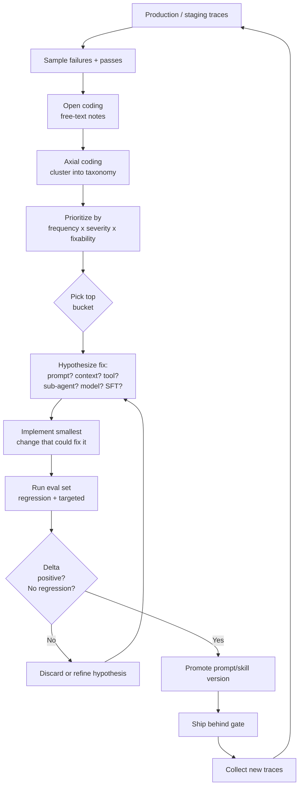

# Systematically Improving LLM Agents from Eval Results

A research dossier for the QualOps code-review agent (Analyze → Review → Fix → Report → Judge), built on the Claude Agent SDK and deployed as fixed versions in CI. Scope is **offline improvement**: take eval failures, reason about them, change the system, re-run evals, ship. Online RLHF and continuous self-tuning in production are explicitly out of scope.

Author: QualOps Research, May 2026

---

## Executive summary

Once an evaluation harness exists, the bottleneck for agent quality is not "more model" — it is the discipline of systematic improvement. The community has converged on a recognizable loop: collect failure traces, perform open coding (annotate freely) and axial coding (cluster into a taxonomy) à la Hamel Husain and Eugene Yan; pick the largest, fixable cluster; choose the smallest intervention that plausibly fixes it (prompt edit → context change → tool redesign → sub-agent split → few-shot mining → fine-tune → model swap); run the eval; gate on regression. Around that loop, four newer disciplines are now mainstream: **prompt-as-code** version control with promotion gates, **automatic prompt optimization** via DSPy/MIPROv2, TextGrad, OPRO, Promptbreeder, AdalFlow, SAMMO, **context engineering** (curating the working-set rather than stuffing the window), and **eval-gated CI** with golden traces and snapshot tests. For a multi-stage code-review agent like QualOps, the highest-leverage early moves are usually (1) error taxonomy on real PR traces, (2) per-stage rather than end-to-end evals, (3) tool-surface cleanup, (4) targeted few-shot mining from confirmed-failure PRs, and (5) routing easy diffs to a cheaper model. Fine-tuning and DPO on traces are the long-game once the prompt/context surface is exhausted.

---

## 1. Error analysis methodology

The single most cited technique in the modern eval literature is structured **error analysis**, popularized by Hamel Husain (in "Your AI product needs evals" and "A Field Guide to Rapidly Improving AI Products"), Eugene Yan, and Shreya Shankar. The method is borrowed from grounded-theory qualitative research: open coding → axial coding → frequency-weighted prioritization.

### The two-pass coding method

**Pass 1 — Open coding (bottom-up).** Sit with raw traces. For each failed (and a sample of passing) example, write a free-text note describing what went wrong. Critically, do not pre-define categories; let them emerge. Hamel emphasizes that top-down taxonomies — "this is a hallucination", "this is a refusal" — bias annotators toward generic ML categories that miss domain-specific failure modes. Bottom-up coding at NurtureBoss surfaced "date handling" as the dominant failure class and lifted that subtask from 33% to 95% accuracy.

**Pass 2 — Axial coding.** Group the open-coded notes into a small set of error categories ("axes"). Hamel recommends an LLM-assisted clustering pass over the notes, then human review of the proposed taxonomy. Output: an error taxonomy of typically 5–15 categories with frequency counts.

**Frequency-weighted prioritization.** Rank categories by `frequency × business cost × fixability`. Spend engineering effort top-down. The classic mistake is fixing rare-but-vivid failures because they are easier to remember.

### A concrete error-taxonomy template (QualOps-shaped)

| ID | Category | Stage | Open-coding signature | Frequency | Severity | Fixability | Priority |
|----|----------|-------|----------------------|-----------|----------|-----------|----------|
| E1 | False positive on idiomatic style | Review | "agent flagged ternary as 'unreadable'" | 32% | Low | High | P1 |
| E2 | Missed null-deref across files | Analyze | "didn't load callee" | 18% | High | Medium | P1 |
| E3 | Fix proposed wrong import | Fix | "imported from wrong module" | 11% | Medium | High | P2 |
| E4 | Judge rated harmless nit as "blocker" | Judge | "severity inflated" | 9% | Medium | High | P2 |
| E5 | Refused on large diff | Analyze | ">200 file diff truncated" | 4% | High | Low | P3 |

A row produces (a) a deterministic regression test, (b) a candidate fix hypothesis, (c) optionally an eval-set sample to add to the next harness pass.

### Eugene Yan's complementary framing

Yan's "Task-Specific LLM Evals That Do & Don't Work" emphasizes that evals must be tied to *behaviors a human PM would care about*, not generic NLP scores. He argues for a four-axis decomposition (correctness, instruction-following, factuality, coherence) but explicitly says these are starting points — your taxonomy must be domain-specific. His "Patterns for Building LLM-based Systems" is the canonical write-up of LLM-as-judge tradeoffs.

### Shreya Shankar's "validators of validators"

Shankar's research (e.g. EvalGen, "Who Validates the Validators?") is the rigorous case that LLM-as-judge scorers themselves drift from human preferences and need their own calibration set. For QualOps, this means whatever Judge stage you use must have a periodically refreshed gold-set of judged-by-humans examples.

---

## 2. The eval-driven development loop



The loop has four properties worth preserving:

1. **Failures are routed back to the eval set**, not just fixed. Otherwise the regression suite never grows.
2. **Hypothesis is logged separately from the diff.** "I changed the system prompt because X" matters when the next eval shows a regression six weeks later.
3. **One change at a time.** Multi-variate changes invalidate the delta and stall debugging.
4. **The eval set is versioned with the code.** A passing score on v3 of the eval against v3 of the prompt is the only meaningful claim.

---

## 3. Prompt engineering as an iteration discipline

The era of "prompt is whatever string is in `messages[0]`" is over. Anthropic's own prompt-engineering guides for Claude 4.x ("Prompting best practices", "Effective context engineering for AI agents") and OpenAI's GPT-5 prompt cookbook converge on the same skeleton:

```
[Role]      You are <persona, scope>.
[Task]      Goal in 1–2 sentences.
[Context]   Static background, dynamic retrieval, tool surface.
[Examples]  Few-shot, ideally diverse and including hard cases.
[Format]    Output schema (XML / JSON / markdown sections).
[Guardrails] Out-of-scope behaviors, refusal triggers, escalation.
```

Anthropic specifically recommends XML-tag structuring for Claude (`<example>`, `<context>`, `<task>`), placing tool definitions in the system message, instructions in the user turn, and using "think step by step" — or extended thinking — for multi-stage tasks.

### Prompt-as-code

Treat prompts as first-class source. Concretely:

- **Version control**: prompts live in the repo, not a UI. Every change is a PR.
- **Immutable IDs**: each prompt version gets a content hash; logs reference it.
- **Promotion gates**: dev → staging → prod, with eval thresholds at each boundary.
- **Full execution context is versioned**: the prompt, the model, the temperature, the tool list, retrieval config — all together. A prompt version that worked on Sonnet 4.0 may regress on 4.7.
- **Two-axis A/B**: by prompt version and by traffic slice. Braintrust, Langfuse, LangSmith, PromptLayer, LaunchDarkly all implement this.
- **Linting**: detect missing tags, contradictory instructions, redundant guardrails.

### Structured prompt scaffolding patterns

- **Decomposition tags.** Wrap the diff in `<diff>`, the relevant prior code in `<context>`, the rules in `<policy>`. Claude was trained on XML-tagged data, so this hits the model where it is most reliable.
- **Output contract first.** State the output schema before the body of the request — models frequently forget late-stated formats.
- **Negative instructions.** "Do not invent function names not present in `<context>`" is more effective than implicit assumptions.
- **Self-check footer.** "Before producing your answer, list the assumptions you made; if any are uncertain, mark `LOW_CONFIDENCE`." This is a poor-man's reflection (see §9).

---

## 4. Automated prompt optimization

This is a crowded field; treat the entries below as a menu, not a stack.

| Tool | Year | Mechanism | When it shines | When it fails |
|------|------|-----------|----------------|---------------|
| **APE** (Zhou et al.) | 2022 | LLM proposes prompt candidates, scored on a held-out set, keep best. | Single-step tasks with clear metric. | Multi-stage agents; metric noise. |
| **OPRO** (Google) | 2023 | LLM is shown previous prompts + scores, asked to write a better one. Iterative. | Math / reasoning where metric is binary. | Long prompts; tool-using agents. |
| **Promptbreeder** (DeepMind) | 2023 | Evolutionary: mutates both task prompts AND the mutation prompts. Beats OPRO on GSM8K (83.9% vs 80.2%). | Tasks where you can run thousands of evals cheaply. | Cost; doesn't optimize tool use. |
| **DSPy / MIPROv2** (Stanford NLP) | 2024 | "Programs not prompts": you write modules with signatures, MIPROv2 jointly optimizes instructions + few-shot demos via Bayesian search over bootstrapped traces. | Multi-stage pipelines (perfect for QualOps). Strong with metric-driven optimization. | Requires writing your pipeline in DSPy idioms. |
| **TextGrad** (Stanford / Yuksekgonul) | 2024 | "Backpropagation through text": LLM-generated textual feedback used as gradient through the program. | Composable systems where each step has a critic-able output. | Setting up the textual loss; cost. |
| **Trace** (Microsoft) | 2024 | Generalizes TextGrad: traces execution, propagates feedback as updates to *any* parameter (prompt, code, tool spec). | Heterogeneous pipelines (prompt + tools + retriever). | Early-stage, few production case studies. |
| **AdalFlow** (SylphAI) | 2024 | PyTorch-style auto-diff over LLM workflows; combines TextGrad-style gradients + DSPy bootstrapping. Reports SOTA accuracy on prompt opt benchmarks. | Teams that want a single library covering both directions. | Newer, smaller community than DSPy. |
| **SAMMO** (Microsoft Research) | 2024 | Treats prompts as function graphs; mutation operators over structure (move section, delete example, paraphrase). | Long structured prompts (manuals, policies). | Tasks needing example mining more than structural surgery. |

### Practical guidance for QualOps

- For the **Review** and **Judge** stages — both narrow, scorable on labeled PRs — DSPy/MIPROv2 is the best fit. Write the stage as a `Module`, define a metric on the eval set, run MIPROv2.
- For the **Fix** stage, where the output is code (and "correctness" requires running tests), AdalFlow + TextGrad-style textual feedback over `tests pass / fail / lint` is the better mental model.
- Promptbreeder/OPRO are mostly historical interest now; their results have been folded into MIPROv2.
- All of these need a *cheap, fast metric*. Build it before reaching for an optimizer.

---

## 5. Few-shot example mining and ICL improvements

Few-shot examples are the highest-leverage, lowest-risk knob in the system. The 2024–25 literature has three clear lessons:

1. **Quality dominates quantity.** A handful of well-chosen demonstrations beat dozens of mediocre ones. Cleanlab and others show that even a single noisy example can reduce accuracy.
2. **Diversity matters more than similarity.** A retrieved set of three near-duplicates teaches less than three diverse but on-topic examples.
3. **Dynamic retrieval > static set** for heterogeneous inputs. Encode each candidate example, encode the live query, retrieve k-NN, inject as few-shot.

### Mining recipe for a code-review agent

1. Take the labeled error taxonomy from §1.
2. For each high-priority bucket (E1, E2, …), sample 2–3 *clean* fixed examples — input PR, ideal review comments, ideal Fix output. These become "canonical" few-shots.
3. Build a vector index over these canonical examples keyed by diff features (language, file types, lines changed, presence of tests).
4. At inference, retrieve top-k examples from the index and inject them.
5. Add **contrastive examples**: pairs of `(borderline diff, correct minimal review)` so the agent learns where to *not* comment. Code-review agents over-flag by default; contrastive negatives are the cure.
6. Recompute the index when the eval set grows.

Anthropic's own context-engineering guide flags few-shot curation as one of the three highest-leverage activities; in their phrasing, "diverse, canonical examples" is the goal, not exhaustive coverage.

---

## 6. Skill / sub-agent decomposition

Anthropic's "Building Effective Agents" essay defines the small set of patterns you should reach for *before* assuming you need a fully autonomous agent. They are:

- **Prompt chaining** — fixed pipeline of LLM calls. (QualOps's Analyze → Review → Fix → Report is one.)
- **Routing** — classifier sends the request to a specialist prompt.
- **Parallelization** — same input to N specialists, voted/aggregated.
- **Orchestrator-workers** — central LLM dispatches dynamically; subtasks not predeterminable. Anthropic calls out coding tasks specifically — the number/nature of files to touch is unknowable up front.
- **Evaluator-optimizer** — generator + critic loop until acceptance criterion met.

### When to split a monolithic prompt

You should consider sub-agent decomposition when:

- One prompt is doing two qualitatively different jobs ("review code AND format the report") and your error taxonomy shows error types from both jobs.
- Required tools differ across phases (Analyze needs static-analysis tools; Report just needs Markdown).
- One phase needs a stronger model than another.
- The prompt has crossed ~3–5K tokens and instructions are starting to interfere ("instruction hierarchy" decay; later instructions overpower earlier ones).

### Anthropic's Skills mechanism

Skills (released 2025, expanded through 2026) are filesystem-based, on-demand context bundles — instructions, scripts, reference material — that the agent loads only when relevant. The cwc-workshops example reduced a 400-line monolithic inventory-agent prompt by extracting policies into Skills + delegating arithmetic to a code-execution tool + introducing a callable sub-agent. The relevant pattern for QualOps:

- Each language (TS, Python, Go, Rust) is a Skill containing language-specific review heuristics.
- Each error-taxonomy bucket with stable rules can become a Skill.
- The Judge is a sub-agent with a tighter system prompt and only the report-shaped tools.

Caveat: orchestrator-worker architectures use **10–15× more tokens** than a single agent. Reach for them when the accuracy gain justifies the cost — typically when single-agent eval scores plateau and the failure analysis shows clean phase boundaries.

### Code-review-agent specific decomposition (2026 state of the art)

- **Greptile v3** uses parallel sub-agents on top of the Claude Agent SDK to trace dependencies across files and check git history. Reports 82% bug catch vs CodeRabbit's 44% in independent benchmarks (with more false positives).
- **Qodo 2.0** (Feb 2026) shipped an explicit multi-agent review architecture and reports outperforming seven competitors.
- **CodeRabbit** stays single-agent / PR-scoped, optimizing for speed and conciseness.

The pattern: the more *cross-file* your reviews need to be, the more the orchestrator-worker pattern (with a code-graph indexer as a tool) pays for itself.

---

## 7. Tool design

Tool design is the single most under-appreciated lever. Anthropic's "Writing tools for agents" guide is the canonical reference; the highlights are:

- **Naming**: namespace by service (`github_list_prs`, not `list_prs`); verb_object form.
- **Description is a prompt.** It is read by the model on every call. Be explicit about *when* to use the tool, what inputs are valid, what outputs to expect, and importantly what the tool will NOT do.
- **Schema with examples.** For complex inputs, the `input_examples` field beats prose. JSON Schema is necessary but not sufficient.
- **Consolidate, don't proliferate.** Fewer, more capable tools beat many narrow ones. A `code_search(query, kind)` is better than four `find_function`, `find_class`, `find_import`, `find_callsite` tools — the model gets confused choosing among overlapping options.
- **Return high-signal text.** Stable identifiers beat opaque internal IDs. Pruned/summarized output beats firehose dumps; agents pay tokens to read tool returns.
- **Error messages are pedagogy.** A tool that returns "Error 422" teaches the agent nothing. "Error: file path must be relative to repo root; you passed an absolute path; try `src/foo.py`." enables self-correction.
- **Observable side effects.** If a tool mutates state, return the new state in the response so the agent doesn't have to call a follow-up read.

### QualOps-specific tool audit checklist

- [ ] Each tool's description has a "use this when" and a "do NOT use this when".
- [ ] No two tools have overlapping use cases without explicit disambiguation in their descriptions.
- [ ] Error returns are actionable text, not numeric codes.
- [ ] Tool count per stage ≤ 7 (the empirical comfort zone for Claude Sonnet/Opus).
- [ ] Long outputs (file contents, AST dumps) are paginated, not truncated mid-token.
- [ ] One canonical "search the code graph" tool, not five.

---

## 8. Context engineering

"Context engineering is the delicate art and science of filling the context window with just the right information for the next step" — Andrej Karpathy. The framing has been formalized through 2025–26 by Anthropic ("Effective context engineering for AI agents"), Lilian Weng, and the LangChain team. The CPU/RAM analogy is now standard: the model is the CPU; the context window is RAM; what you load is the engineering.

### The big findings

- **Context rot.** Recall and reasoning degrade as token count grows, well before the nominal limit. Databricks observed correctness loss at 32K for Llama 3.1 405B; smaller models earlier. Larger context windows are not free.
- **Lost-in-the-middle (Liu et al., Stanford).** Performance is U-shaped: instructions at the very start or very end of the context win; buried middle loses. Critical guardrails should be at one of the ends — Anthropic's recommendation is system prompt for stable rules, last user turn for the immediate ask.
- **Instruction hierarchy.** When system, user, and tool-output instructions conflict, models tend to follow the most recent and most concretely worded. Conflict-free design beats stacking.

### Tactics

- **Curate, don't accumulate.** At each step ask: "is this token earning its place?" Strip stale tool outputs, archived plans, unused docs.
- **Dynamic instruction loading** (= Skills): only inject the language-specific or domain-specific rules when the input matches.
- **Retrieval beats stuffing.** A 2K-token retrieved excerpt of the right file beats a 50K dump of the directory.
- **Working memory vs reference memory.** Working memory (immediate plan, last tool result) goes in-context; reference memory (project guidelines, codebase facts) goes behind a retrieval tool.
- **Plan persistence.** Long agent runs benefit from an explicit `plan.md`-style scratchpad maintained by the orchestrator, refreshed each turn rather than relying on the model to remember what it decided fifteen turns ago.

For QualOps specifically: never feed the entire repo. Feed (a) the diff, (b) the immediate symbol context (callers/callees of touched symbols), (c) project conventions for the relevant language, and nothing else. Add a tool the agent can call when it needs more.

---

## 9. Self-refinement and reflective patterns

The core papers — **Self-Refine** (Madaan et al.), **Reflexion** (Shinn et al.), **CRITIC** (Gou et al.) — established that having the model critique its own output and try again improves accuracy on a wide range of tasks without weight updates. The pattern is a generate-critique-refine loop, optionally with a separate verifier model.

### When reflection is net positive

- The metric is *expensive to compute by humans* but *cheap for an LLM judge*. Code review fits well: rerunning unit tests is cheap; a reviewer disagreeing about a comment is expensive.
- Errors are *recognizable after the fact* (the agent often spots its own mistake when prompted). Reasoning errors, format violations, missed edge cases.
- You can afford ~2× tokens per task.

### When reflection is a trap

- The error mode is "confidently wrong with no internal signal" — the critic agrees with the bad output. Hallucinations of API names are typical.
- Per-call latency matters more than quality (interactive use).
- The critic is the same model with the same context as the actor — same blind spots.

### Concrete recipes for QualOps

- **Judge as critic.** The Judge stage is already an evaluator-optimizer pattern. Make it explicit: Judge can return `accept` / `reject_with_reason`, and on `reject_with_reason` re-run Review (bounded retries: 2 max).
- **Verifier model trick.** Run the Fix stage with Sonnet, the Judge with Opus. Different models reduce shared blindspots; this is empirically the cheap win.
- **Test execution as ground-truth critic.** For Fix outputs, the actual unit-test result is the highest-quality verifier you will ever have. Use it.

---

## 10. Routing and model selection

Routing classifies an input and dispatches to the cheapest model that can handle it. The economics are dramatic: industry routers report 30–85% cost reduction with quality flat or slightly improved.

### Routing strategies

- **Predictive (offline classifier).** A small model or feature-based classifier inspects the input, predicts difficulty, picks a tier. Fast, cheap, training data needed.
- **Cascading.** Try Haiku first; if it returns low-confidence or fails a check, escalate to Sonnet, then Opus. Easy to implement with no training; latency penalty when escalation triggers.
- **Mixture-of-agents (MoA).** Multiple models answer in parallel; an aggregator synthesizes. Highest quality, highest cost.

### For QualOps

A reasonable default cascade:

1. **Diff size / language detector** (no LLM) — small CSS/text changes go to Haiku-tier; backend logic changes to Sonnet; cross-cutting refactors and security-sensitive paths to Opus.
2. **Confidence escape hatch** — if the Judge stage rejects with reason "ambiguous", upgrade and re-run Review.
3. **Per-stage routing** — Analyze and Report can be small models; Review and Fix usually want strong; Judge wants strong (or at least *different*).

This pairs well with prompt-as-code: each prompt version pins its model, and routing is just "which version-id do we use for this input".

---

## 11. Fine-tuning vs. prompt engineering

The overwhelming majority of agent-quality wins come before fine-tuning is required. The order of operations in 2026 is:

1. Better prompt + scaffold.
2. Better few-shot examples.
3. Better tools / context.
4. Sub-agent decomposition.
5. Automated prompt optimization (DSPy/AdalFlow).
6. *Then* consider fine-tuning.

### When SFT pays off (offline only — in our scope)

- The task has a stable shape, you have ≥1K labeled examples, prompt iteration has plateaued.
- Latency matters and you want to compress an Opus-level prompt into a smaller fine-tuned Sonnet/Haiku.
- You want to teach a tool-use *trajectory pattern*, not just a knowledge cut.

### Two relevant offline techniques

- **Distillation from agent traces.** Run the strong agent on a curated set, record the (input, plan, tool calls, output) trace, and SFT a smaller model on those traces. Recent work (Structured Agent Distillation, 2025; Agent Fine-tuning through Distillation 2025) shows you can preserve >90% of teacher quality at <20% the cost on narrow domains.
- **DPO / KTO from preference pairs.** From your eval set you have `(input, accepted_output, rejected_output)` triples — exactly the DPO format. KTO is more flexible: works with thumbs-up/down rather than paired preferences. Both are offline and weight-update style; both are in scope under our policy because they happen between releases, not during one.

### What to avoid

- Online RLHF / continuous self-training in production. Out of scope.
- Premature fine-tuning. The cost is real (training infra, eval against drift, regression risk) and the gains often replicate cheaper prompt changes.

---

## 12. Regression suites and gating

Improvements regress. The mechanism that prevents this is the regression suite, gated in CI.

### Three layers

- **Unit / assertion tests.** Cheap, deterministic, not LLM-judged. Example: "given diff D1, the Review output must contain `null check`". Authored from error analysis (§1). Goal: ratchet — once we fix it, it stays fixed.
- **Golden traces / snapshot tests.** Record the entire tool-call sequence and final output for a known PR. On change, diff the new run against the snapshot. Tools: EvalView (open-source, Playwright-style for agents), Braintrust, Confident AI / DeepEval. Particularly catches *behavioral* regressions (tool order, retry count) that string-level evals miss.
- **LLM-as-judge eval set.** Larger, runs less often (per-PR or per-night), produces a holistic score. Used for trend tracking and gate thresholds.

### CI gate design

- Fail the build if any deterministic regression test breaks.
- Fail if the LLM-judge score drops by more than X% (3% is a common starting threshold) versus the main branch.
- Surface a delta report: which prompt/tool/skill changed, which eval categories moved.
- Always allow override by an explicit reviewer comment ("accepted regression on E1 because we accepted E5 win"), tracked.

### Don't forget calibration

LLM-judge scores drift as both judge and judged models update. Refresh the human-labeled calibration set quarterly; otherwise your pass/fail line wanders.

---

## 13. Data flywheel

Even though we ship fixed versions, *the next version* benefits from production traces. Shankar's "Data Flywheels for LLM Applications" is the reference text. The flywheel:

```
production traces -> sample -> human-label (or LLM-pre-label + human review)
   -> error analysis -> (eval set growth) + (few-shot mining) + (DPO pairs)
   -> next release
```

Practical suggestions for QualOps:

- **Trace everything.** Per stage: input, prompt version, tool calls, model version, output, judge verdict, downstream signal (was the comment dismissed by the human reviewer? was the fix merged?).
- **Stratified sampling.** Don't sample uniformly; over-sample low-confidence traces and traces where the judge disagreed with downstream human action.
- **Decompose labels.** Shankar's specific finding: holistic "is this good?" labels are noisy. Split into dimensions (correctness, severity, conciseness, style fit) and label each separately. Inter-rater agreement goes up.
- **Few-shot mining loop.** Newly-labeled "exemplary" traces are first-class candidates for the dynamic few-shot index (§5). Newly-labeled bad traces become eval-set additions and DPO negatives.

---

## 14. Code-review-agent specific patterns observed in the field

Patterns that recur across Cursor, Sourcegraph Cody, GitHub Copilot Code Review, Greptile, CodeRabbit, Qodo (formerly Codium), and Anthropic's own Claude code reviews:

1. **Code-graph indexing as a tool, not as in-context.** All serious players index the repo (symbols, calls, types, blame) and expose retrieval rather than dumping into context. Greptile's graph-of-the-repo and Sourcegraph Cody's code-search are the explicit cases.
2. **Diff-aware vs project-aware.** CodeRabbit optimizes the PR-diff scope; Greptile is project-aware. Project-aware catches more cross-file bugs at the cost of more false positives. Pick deliberately and tune the noise budget.
3. **Multi-pass review.** A first pass identifies candidate issues; a second pass filters / merges / re-ranks them by severity. This is the orchestrator-worker pattern with a small team of specialist sub-agents (security, performance, style, correctness) plus a deduplicator.
4. **Severity gating.** False-positive aversion drives most user satisfaction. Apply a calibrated severity threshold *after* generation, dropping anything below `medium`. Easier to tune than asking the model to suppress at generation time.
5. **Conventions and rules as Skills/configs.** Per-language, per-repo style guides loaded only when relevant.
6. **Use the test suite as oracle for Fix.** Anything that can run tests should. The Fix stage's hard ground truth is "tests still pass and the bug repro test now passes". This collapses into a deterministic eval and is the single biggest accuracy lever.
7. **Severity-aware routing.** Cheap model for nits; strong model for security and concurrency. Mirrors §10.
8. **Don't trust your own confidence.** Agents are systematically over-confident on cross-file claims. Force the agent to cite a file:line for every claim; if it can't, drop the claim. (This is the "citations as guardrail" pattern.)

---

## Improvement playbook (step-by-step)

A concrete process for QualOps when an eval reveals issues.

1. **Lock the eval.** Pin model versions, prompt versions, eval-set version. Reproduce the failures. If you can't reproduce, your eval has variance you must fix first.
2. **Sample and open-code.** Take 30–50 failing traces (and 10–20 passing for contrast). Annotate freely — don't pre-categorize. Two annotators where possible; compare notes.
3. **Axial code into a taxonomy.** Cluster the notes. LLM-assist with human review. Aim for 5–15 buckets. Tag every example with one or more bucket IDs.
4. **Frequency-prioritize.** Pick the top bucket by `frequency × severity × fixability`.
5. **Localize to a stage.** Which of Analyze / Review / Fix / Report / Judge is producing the error? If it's a chain effect, the *earliest* stage is usually the place to fix.
6. **Pick the smallest fix that could plausibly work.** In rough cost order:
   - Prompt edit (clarify, add negative example, restructure).
   - Few-shot addition (drop in 2–3 canonical examples).
   - Context edit (load a Skill, prune noise).
   - Tool surface change (better description, error message, schema).
   - Sub-agent split.
   - Run a prompt optimizer (DSPy/MIPROv2 or AdalFlow) on the stage.
   - Model swap or routing rule.
   - SFT / DPO from collected traces.
7. **Implement one change.** Tag the prompt version. Note the hypothesis.
8. **Run targeted + regression evals.** Targeted = the bucket you are fixing. Regression = full eval set. Both must pass the gate.
9. **Decide.** Ship if delta positive and no regression. Else, refine hypothesis or rollback.
10. **Feed back.** New traces enter the labeling queue; new fixed examples enter the few-shot index; new failure modes enter the taxonomy.
11. **Cadence.** Run this loop weekly on the largest bucket; re-cluster the taxonomy monthly; refresh judge calibration quarterly.

---

## Decision tree: given this error, try this fix first

```mermaid
flowchart TD
    Start([Eval reveals failure]) --> Q1{What's the<br/>error type?}

    Q1 -->|Format / schema<br/>violation| F1[Tighten output<br/>format in prompt;<br/>add format example]
    Q1 -->|Misunderstood<br/>instruction| F2[Restructure prompt:<br/>role/task/format/<br/>guardrails]
    Q1 -->|Missing domain<br/>knowledge| F3[Add Skill or<br/>retrieval tool;<br/>NOT just stuff context]
    Q1 -->|Hallucinated<br/>fact / API| F4[Add citation<br/>requirement; add<br/>retrieval tool]
    Q1 -->|Wrong tool used /<br/>tool confusion| F5[Tool design:<br/>names, descriptions,<br/>consolidate overlap]
    Q1 -->|Tool returned ok,<br/>agent ignored result| F6[Tool description<br/>+ tool output<br/>summarization]
    Q1 -->|Reasoning chain<br/>broke| F7[Add extended thinking<br/>or sub-agent split]
    Q1 -->|Style / tone /<br/>over-flagging| F8[Few-shot mining:<br/>contrastive examples<br/>of don't-flag cases]
    Q1 -->|Cross-file<br/>blindness| F9[Add code-graph tool;<br/>orchestrator-worker<br/>pattern]
    Q1 -->|Long-context<br/>recall failure| F10[Context engineering:<br/>prune, dynamic load,<br/>move key info to ends]
    Q1 -->|Judge<br/>miscalibrated| F11[Refresh judge<br/>calibration set;<br/>verifier model]
    Q1 -->|Single-stage<br/>plateau across many<br/>error types| F12[Run prompt optimizer<br/>DSPy / AdalFlow]
    Q1 -->|Latency / cost<br/>plateau, accuracy ok| F13[Routing or<br/>distillation SFT]
    Q1 -->|Error mode is<br/>persistent + structured<br/>+ many examples| F14[DPO from preference<br/>pairs; otherwise SFT]

    F1 --> R[Re-run eval, gate, ship]
    F2 --> R
    F3 --> R
    F4 --> R
    F5 --> R
    F6 --> R
    F7 --> R
    F8 --> R
    F9 --> R
    F10 --> R
    F11 --> R
    F12 --> R
    F13 --> R
    F14 --> R
```



---

## References

### Error analysis and the eval-driven loop
- [Hamel Husain — Your AI Product Needs Evals](https://hamel.dev/blog/posts/evals/) — canonical write-up of why and how.
- [Hamel Husain — A Field Guide to Rapidly Improving AI Products](https://hamel.dev/blog/posts/field-guide/) — open/axial coding, frequency prioritization, NurtureBoss case study (33%→95%).
- [Hamel Husain — Why is "error analysis" so important](https://hamel.dev/blog/posts/evals-faq/why-is-error-analysis-so-important-in-llm-evals-and-how-is-it-performed.html) — concrete walkthrough.
- [Hamel Husain — Doing Error Analysis Before Writing Tests](https://hamel.dev/notes/llm/officehours/erroranalysis.html) — order-of-operations point.
- [Hamel Husain & Shreya Shankar — LLM Evals FAQ (Jan 2026)](https://hamel.dev/blog/posts/evals-faq/) — current consolidated reference.
- [Eugene Yan — Task-Specific LLM Evals That Do & Don't Work](https://eugeneyan.com/writing/evals/) — pragmatic taxonomy.
- [Eugene Yan — Patterns for Building LLM-based Systems](https://eugeneyan.com/writing/llm-patterns/) — system-level patterns.
- [Eugene Yan — Evaluating LLM-Evaluators (LLM-as-Judge)](https://eugeneyan.com/writing/llm-evaluators/) — calibration of judges.
- [Husain, Yan, Bischof, Frye, Liu, Shankar — What We Learned from a Year of Building with LLMs (Part I, II, III)](https://www.oreilly.com/radar/what-we-learned-from-a-year-of-building-with-llms-part-i/) — multi-author field report; tactical/operational/strategic split.
- [Shreya Shankar — Data Flywheels for LLM Applications](https://www.sh-reya.com/blog/ai-engineering-flywheel/) — production-trace flywheel.
- [Langfuse — Error Analysis to Evaluate LLM Applications](https://langfuse.com/blog/2025-08-29-error-analysis-to-evaluate-llm-applications) — tooling-side perspective.

### Prompt engineering and prompt-as-code
- [Anthropic — Prompting best practices for Claude](https://platform.claude.com/docs/en/build-with-claude/prompt-engineering/claude-prompting-best-practices) — XML, system vs user, thinking.
- [Anthropic — Interactive Prompt Engineering Tutorial](https://github.com/anthropics/prompt-eng-interactive-tutorial) — 9-chapter hands-on.
- [Anthropic — Effective context engineering for AI agents](https://www.anthropic.com/engineering/effective-context-engineering-for-ai-agents) — core 2025 doc.
- [Langfuse — Prompt Version Control](https://langfuse.com/docs/prompt-management/features/prompt-version-control) — versioning mechanics.
- [Braintrust — What is prompt versioning](https://www.braintrust.dev/articles/what-is-prompt-versioning) — practitioner guide.
- [LaunchDarkly — Prompt Versioning & Management Guide](https://launchdarkly.com/blog/prompt-versioning-and-management/) — env promotion patterns.

### Automatic prompt optimization
- [DSPy — Optimizers overview](https://dspy.ai/learn/optimization/optimizers/) — Stanford NLP framework.
- [DSPy — MIPROv2 API](https://dspy.ai/api/optimizers/MIPROv2/) — joint instruction + few-shot.
- [DeepWiki — MIPROv2 internals](https://deepwiki.com/stanfordnlp/dspy/4.4-miprov2:-instruction-and-parameter-optimization) — bootstrap, propose, Bayesian search.
- [Promptbreeder paper (arXiv 2309.16797)](https://arxiv.org/pdf/2309.16797) — DeepMind, evolutionary prompt opt.
- [APE — Automatic Prompt Engineer](https://www.promptingguide.ai/techniques/ape) — Zhou et al., the foundational work.
- [TextGrad](https://tailoredai.substack.com/p/automating-prompt-optimisation-a) — textual backprop.
- [SAMMO — Microsoft Research](https://www.microsoft.com/en-us/research/blog/sammo-a-general-purpose-framework-for-prompt-optimization/) — structure-aware metaprompt opt.
- [SAMMO repo](https://github.com/microsoft/sammo) — code.
- [AdalFlow — SylphAI](https://github.com/SylphAI-Inc/AdalFlow) — PyTorch-style auto-diff for LLM apps.
- [Cameron Wolfe — Automatic Prompt Optimization survey](https://cameronrwolfe.substack.com/p/automatic-prompt-optimization) — landscape overview.

### Few-shot ICL improvements
- [Learning to Retrieve In-Context Examples (arXiv 2307.07164)](https://arxiv.org/html/2307.07164v2) — dense retrieval for examples.
- [Cleanlab — Reliable Few-Shot Prompts](https://cleanlab.ai/blog/learn/reliable-fewshot-prompts/) — noisy-example hazards.
- [Many-Shot In-Context Learning (arXiv 2404.11018)](https://arxiv.org/pdf/2404.11018) — the long-context regime.
- [PromptHub — Few-Shot Prompting Guide](https://www.prompthub.us/blog/the-few-shot-prompting-guide) — practical patterns.

### Agent architecture
- [Anthropic — Building Effective Agents](https://www.anthropic.com/research/building-effective-agents) — workflows + agents taxonomy.
- [Anthropic — Building Effective AI Agents (PDF resource hub)](https://resources.anthropic.com/building-effective-ai-agents) — extended cookbook with case studies (Coinbase, Intercom, Thomson Reuters).
- [Anthropic — Equipping agents with Agent Skills](https://www.anthropic.com/engineering/equipping-agents-for-the-real-world-with-agent-skills) — Skills mechanism.
- [Anthropic — Agent Skills overview](https://platform.claude.com/docs/en/agents-and-tools/agent-skills/overview) — docs.
- [Anthropic Subagents — Claude Code Docs](https://docs.anthropic.com/en/docs/claude-code/sub-agents) — custom subagent how-to.
- [Anthropic CWC workshops](https://github.com/anthropics/cwc-workshops) — 400-line-prompt → skills + subagents refactor walkthrough.

### Tool design
- [Anthropic — Writing tools for agents](https://www.anthropic.com/engineering/writing-tools-for-agents) — naming, schema, response design.
- [Anthropic — Implement tool use](https://docs.anthropic.com/en/docs/agents-and-tools/tool-use/implement-tool-use) — schema docs.
- [Anthropic — Advanced tool use](https://www.anthropic.com/engineering/advanced-tool-use) — input_examples and friends.

### Context engineering
- [Anthropic — Effective context engineering for AI agents](https://www.anthropic.com/engineering/effective-context-engineering-for-ai-agents) — primary source.
- [LangChain — Context Engineering for Agents](https://blog.langchain.com/context-engineering-for-agents/) — practitioner overview.
- [Lost in the Middle (Liu et al., Stanford)](https://arxiv.org/abs/2307.03172) — U-shaped recall.
- [Decoder — Context engineering vs prompt engineering](https://the-decoder.com/anthropic-claims-context-engineering-beats-prompt-engineering-when-managing-ai-agents/) — the framing shift.

### Reflection / self-refinement
- [Self-Refine (arXiv 2303.17651)](https://arxiv.org/abs/2303.17651) — generate-critique-refine.
- [Reflexion (arXiv 2303.11366)](https://arxiv.org/abs/2303.11366) — verbal RL via self-reflection.
- [CRITIC (arXiv 2305.11738)](https://arxiv.org/abs/2305.11738) — tool-augmented critique.
- [DeepLearning.AI — Agentic Design Patterns: Reflection](https://www.deeplearning.ai/the-batch/agentic-design-patterns-part-2-reflection/) — Andrew Ng's writeup.
- [Self-Reflection in LLM Agents (arXiv 2405.06682)](https://arxiv.org/abs/2405.06682) — empirical effect on problem-solving.

### Routing / model selection
- [IBM Research — LLM routing](https://research.ibm.com/blog/LLM-routers) — predictive vs cascading vs nonpredictive.
- [vLLM Semantic Router](https://vllm-semantic-router.com/) — open-source mixture-of-models.
- [Patronus — AI Agent Routing best practices](https://www.patronus.ai/ai-agent-development/ai-agent-routing) — operational guide.
- [arXiv 2509.07571 — Generalized Routing](https://arxiv.org/html/2509.07571v1) — model + agent orchestration.

### Fine-tuning, distillation, DPO/KTO
- [Direct Preference Optimization (arXiv 2305.18290)](https://arxiv.org/abs/2305.18290) — Rafailov et al.
- [KTO (arXiv 2402.01306)](https://arxiv.org/pdf/2402.01306) — Kahneman-Tversky alignment.
- [HuggingFace — Preference Tuning with DPO methods](https://huggingface.co/blog/pref-tuning) — practical DPO/IPO/KTO.
- [OpenAI — Supervised fine-tuning guide](https://developers.openai.com/api/docs/guides/supervised-fine-tuning) — SFT mechanics.
- [Structured Agent Distillation (arXiv 2505.13820)](https://arxiv.org/html/2505.13820v3) — segment Reason vs Action spans.
- [Agent Fine-tuning through Distillation (arXiv 2510.00482)](https://arxiv.org/html/2510.00482) — domain microagents.
- [Distilling LLM Agent into Small Models](https://github.com/Nardien/agent-distillation) — repo + paper.

### Regression suites and CI gating
- [EvalView — Golden Traces docs](https://github.com/hidai25/eval-view/blob/main/docs/GOLDEN_TRACES.md) — snapshot/regression for agents.
- [Braintrust — Eval-driven development](https://www.braintrust.dev/articles/eval-driven-development) — gate design.
- [DeepEval](https://github.com/confident-ai/deepeval) — open-source LLM eval framework.
- [Evaluation-Driven Development of LLM Agents (arXiv 2411.13768)](https://arxiv.org/html/2411.13768v3) — process model + reference architecture.
- [Pragmatic Engineer — A pragmatic guide to LLM evals](https://newsletter.pragmaticengineer.com/p/evals) — engineering walkthrough.

### Code-review-agent specifics
- [Anthropic — SWE-bench Sonnet engineering](https://www.anthropic.com/engineering/swe-bench-sonnet) — what changed at the model level.
- [Anthropic — Claude Opus 4.7 release](https://www.anthropic.com/news/claude-opus-4-7) — current frontier numbers.
- [Greptile vs CodeRabbit (Greptile blog)](https://www.greptile.com/greptile-vs-coderabbit) — vendor comparison; multi-agent review architecture.
- [Qodo (formerly Codium) — AI Code Review](https://www.qodo.ai/blog/ai-code-review/) — Qodo 2.0 multi-agent architecture.
- [Sverklo](https://github.com/sverklo/sverklo) — open-source code-graph MCP server; pattern reference.
- [FindSkill — Claude Code Review vs Bugbot vs Greptile vs CodeRabbit (May 2026)](https://findskill.ai/blog/claude-code-review-vs-cursor-bugbot-greptile-coderabbit/) — current head-to-head.

### Cross-cutting community
- [Lenny's Newsletter — Evals, error analysis, better prompts (Hamel Husain)](https://www.lennysnewsletter.com/p/evals-error-analysis-and-better-prompts) — accessible interview.
- [Humanloop — Why Your AI Product Needs Evals (Hamel Husain)](https://humanloop.com/blog/why-your-product-needs-evals) — interview transcript.

---

*End of dossier.*
