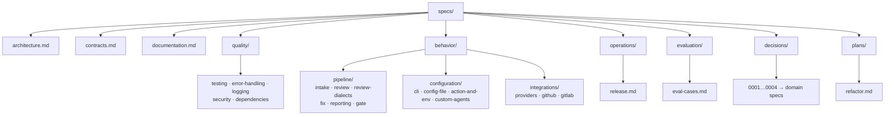

# specs/

Approved, refined specifications — the source of truth for implementation.

**Flow:** `concept/ → specs/ → implementation → website/`. A `concept/` document is exploratory and may be rejected or conflict with others. Once agreed, it is rewritten here as a **gap-free, concise, aligned** spec. Implementation follows the spec precisely; shipped behavior (and only shipped behavior) is then described on the `website/`.

A spec here is binding **once approved**. Authoring is done with the `spec-architect` skill; a spec is not self-approved. **This baseline set is human-approved (EggAI, 2026-07-08)** — the codebase already implements it — with the open decisions resolved (see [`.readiness-report.yaml`](.readiness-report.yaml)). If reality and an approved spec diverge, fix the spec first, then the code. Engineering rules that apply across all specs are in [`../CLAUDE.md`](../CLAUDE.md) / [`../AGENTS.md`](../AGENTS.md).

## What these specs describe

They define the **baseline**: the codebase as it will be after the structure & cleanup refactor — the current functional behavior, restructured and cleaned, with the committed correctness fixes. This is deliberately **not** the functional redesign (verifier, fingerprint identity, folder-config, AI-SDK swap), which is still in `concept/` and will graduate spec-by-spec as it is built. Getting the baseline in sync with the code first is the point.

## Structure

Specs are organized by purpose/domain. Cross-cutting foundations at the top level; behavior and operational concerns in domain folders; the **why** in `decisions/` (each linking to the domain spec that holds the **what**).

Larger specs are split into folders, one file per responsibility, each with a `README.md` overview.

## Index

| Domain | Spec | Scope |
|---|---|---|
| Foundations | [architecture.md](architecture.md) | Module structure, layering, ports, conventions, structural budget |
| Foundations | [contracts.md](contracts.md) | Unified type & validation system (Zod-first, one definition per concept) |
| Foundations | [documentation.md](documentation.md) | Root README + website (user-docs) standard |
| Quality | [quality/](quality/README.md) | testing · error-handling · logging · security · dependencies |
| Behavior | [behavior/pipeline/](behavior/pipeline/README.md) | Orchestration + per-stage: intake, review (+review-dialects), fix, reporting, gate |
| Behavior | [behavior/configuration/](behavior/configuration/README.md) | CLI, config file, Action & env, custom agents |
| Behavior | [behavior/integrations/](behavior/integrations/README.md) | AI providers & dialects; GitHub & GitLab posting |
| Operations | [operations/release.md](operations/release.md) | Release channels, versioning, tag/dist-tag policy, promotion & hotfix |
| Evaluation | [evaluation/eval-cases.md](evaluation/eval-cases.md) | Real-PR "slice" eval-case data contract |
| Decisions | [decisions/](decisions/README.md) | Decision records 0001–0004 (rationale; link to domain specs) |
| Plans | [plans/refactor.md](plans/refactor.md) | Structure & cleanup refactor plan |

## Reading order

New to the project: `architecture.md` → [`behavior/pipeline/`](behavior/pipeline/README.md) → the other `behavior/` folders → `contracts.md` → [`quality/`](quality/README.md). Implementing the refactor: [`plans/refactor.md`](plans/refactor.md) first, with the above as the target contract.
