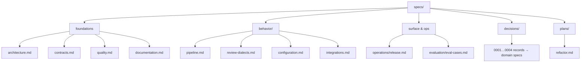

# specs/

Approved, refined specifications — the source of truth for implementation.

**Flow:** `concept/ → specs/ → implementation → docs/`. A `concept/` document is exploratory and may be rejected or conflict with others. Once agreed, it is rewritten here as a **gap-free, concise, aligned** spec. Implementation follows the spec precisely; shipped behavior (and only shipped behavior) is then described in `docs/`.

A spec here is binding **once approved**. Authoring is done with the `spec-architect` skill; a spec is not self-approved — it is **Draft** until `spec-readiness-review` passes and a human records approval, then it becomes the source of truth. If reality and an approved spec diverge, fix the spec first, then the code. Engineering rules that apply across all specs are in [`../CLAUDE.md`](../CLAUDE.md) / [`../AGENTS.md`](../AGENTS.md).

## What these specs describe

They define the **baseline**: the codebase as it will be after the structure & cleanup refactor — the current functional behavior, restructured and cleaned, with the committed correctness fixes. This is deliberately **not** the functional redesign (verifier, fingerprint identity, folder-config, AI-SDK swap), which is still in `concept/` and will graduate spec-by-spec as it is built. Getting the baseline in sync with the code first is the point.

## Structure

Specs are organized by purpose/domain. Cross-cutting foundations at the top level; behavior and operational concerns in domain folders; the **why** in `decisions/` (each linking to the domain spec that holds the **what**).

## Index

| Domain | Spec | Scope |
|---|---|---|
| Foundations | [architecture.md](architecture.md) | Module structure, layering, ports, conventions, structural budget |
| Foundations | [contracts.md](contracts.md) | Unified type & validation system (Zod-first, one definition per concept) |
| Foundations | [quality.md](quality.md) | Testing, coverage, error handling, logging, security, dependencies |
| Foundations | [documentation.md](documentation.md) | Root README + `docs/` standard |
| Behavior | [behavior/pipeline.md](behavior/pipeline.md) | Stages, review pipeline, gate; refactor acceptance list |
| Behavior | [behavior/review-dialects.md](behavior/review-dialects.md) | Structured vs. prose dialect routing (the single dialect home) |
| Behavior | [behavior/configuration.md](behavior/configuration.md) | Config file, CLI, GitHub Action, env vars, custom-agent mechanism |
| Behavior | [behavior/integrations.md](behavior/integrations.md) | AI providers; GitHub/GitLab posting behavior |
| Operations | [operations/release.md](operations/release.md) | Release channels, versioning, tag/dist-tag policy, promotion & hotfix |
| Evaluation | [evaluation/eval-cases.md](evaluation/eval-cases.md) | Real-PR "slice" eval-case data contract |
| Decisions | [decisions/](decisions/README.md) | Decision records 0001–0004 (rationale; link to domain specs) |
| Plans | [plans/refactor.md](plans/refactor.md) | Structure & cleanup refactor plan |

## Reading order

New to the project: `architecture.md` → `behavior/pipeline.md` → the other `behavior/` specs → `contracts.md` → `quality.md`. Implementing the refactor: `plans/refactor.md` first, with the above as the target contract.
