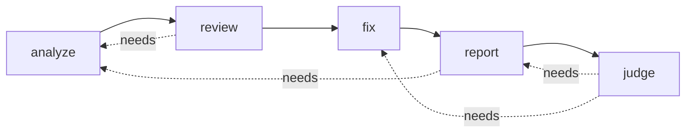

# Spec — Pipeline (overview)

**Status:** Draft (authored 2026-07-08) — pending spec-readiness-review + human approval · Behavior the code must exhibit **after the refactor** = today's behavior plus the committed corrections in [`../../plans/refactor.md`](../../plans/refactor.md) §4 (buckets B/C, flagged ⚠ per stage). No functional redesign here (verifier, fingerprint identity, folder-config are future — `concept/`). Structure that realizes it: [`../../architecture.md`](../../architecture.md).

## Stages

`qualops` (no subcommand) runs the selected stages in dependency order inside a session. One spec per stage:

| Stage | Spec | Responsibility |
|---|---|---|
| analyze | [intake.md](intake.md) | determine the file set to review |
| review | [review.md](review.md) + [review-dialects.md](review-dialects.md) | generate findings (structured/prose) |
| fix | [fix.md](fix.md) | generate/apply fix suggestions |
| report | [reporting.md](reporting.md) | aggregate into a human report |
| judge | [gate.md](gate.md) | deterministic quality gate → exit code |

## Orchestration & sessions

A **session** is a directory under `.qualops/reports/sessions/<name>/` (name defaults to a UTC timestamp `YYYYMMDD-HHMMSS`); every artifact is written there **once**, by the runner. `metadata.json` records the run; `token-stats.json` records total usage at the end.

- **Stages:** `analyze, review, fix, report, judge`. Default run = all five.
- **Dependencies (enforced, topologically ordered):** `review→analyze`; `fix→review`; `report→analyze,review`; `judge→report,fix`. A missing dependency warns; it is not auto-injected.
- **`fix` auto-drop:** on a default run, `fix` is dropped unless `ai.fixStage` is configured (the shipped default config defines it, so `fix` runs by default).
- ⚠ **Resume (F-6):** a stage reuses its artifact **only** under explicit `--resume <session>`. Default runs never silently reuse a prior artifact. *(Today: every stage short-circuits on artifact existence, ignoring `--skip-cache`.)*
- ⚠ **Errors & exit (F-1/F-2/F-3):** a stage failure produces a `StructuredError` artifact; telemetry is flushed before the single process exit; a failed gate sets a non-zero exit code. *(Today: stage failure calls `process.exit(1)` skipping the flush, and a failed gate exits 0.)* Full error/exit contract: [`../../quality/error-handling.md`](../../quality/error-handling.md).

## Known deviations (refactor acceptance list)

Every intended difference from today's code, with its bucket ([`../../plans/refactor.md`](../../plans/refactor.md) §4):

| Area | Today | Spec (post-refactor) | Bucket |
|---|---|---|---|
| Gate → exit code | advisory, exits 0 | failed gate exits non-zero | C (F-1) |
| Telemetry on failure | lost (`process.exit` skips flush) | flushed before exit | C (F-2) |
| Gate thresholds | env-only | config file + env override | C (F-4) |
| Prose gate | forced PASSED | "not gateable" | C (F-5) |
| Resume | implicit, ignores `--skip-cache` | explicit `--resume` only | C (F-6) |
| Agentic confidence | hardcoded `>=7` + configured | configured, once | C (F-13) |
| Parse failure | silent `[]` | repair retry + notice | B (F-16) |
| Enrichment | overwrites model effort | single-pass, preserved | B (F-20) |
| Root-cause / issue-md flags | ignored | honored | B |
| Injection filter, `projectsReviewed` | vestigial | removed | A |
| Rollback metadata | dead (commented out) | restored or removed cleanly | A |
| Fix selection vs config | hardcoded `high`+`>=7` | **open — decide scope** | C? |
