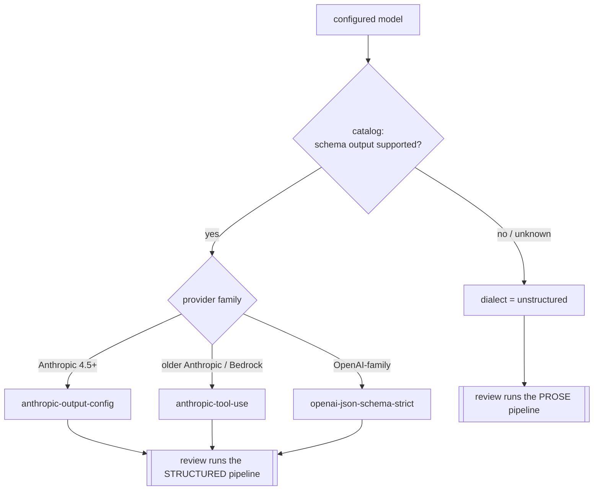

# Spec — Review Dialects (structured vs. prose)

**Status:** Draft (authored 2026-07-08) — pending spec-readiness-review + human approval · **Owner:** TBD
**Domain:** review behavior · **Decision record:** [`decisions/0003`](../../decisions/0003-review-dialects.md)

How QualOps obtains review output from models of differing capability. This is the single home for dialect behavior; [`review.md`](review.md) and [`../integrations/providers.md`](../integrations/providers.md) reference it rather than restating it. Contract only.

## 1. Principle

The output **dialect is a property of the model, not the provider.** The same API endpoint can serve a structured model and an unstructured one depending on the `model` parameter. All routing asks one question — `isUnstructured()` — and nothing else; there are no provider-type or model-name checks in routing code.

## 2. Dialects

| Dialect | Condition | Strategy | Output |
|---|---|---|---|
| `anthropic-output-config` | Claude 4.5+ family | native constrained decoding | validated `Finding[]` |
| `anthropic-tool-use` | older Claude, all Bedrock | forced single-tool schema | validated `Finding[]` |
| `openai-json-schema-strict` | OpenAI-family model the catalog marks as supporting response schema | `json_schema` response format (non-strict flag) + local Zod validation | validated `Finding[]` |
| `unstructured` (prose) | **safe fallback** — any model not known to support schema output | free-text prose pipeline (§4) | Markdown report, **no** `Finding[]` |

Capability comes from a bundled, dated snapshot of the litellm capability catalog (two booleans per model: response-schema support, tool-use support), regenerated before releases — not from model-name pattern matching.

## 3. Selection

**INV-DIA-1 (safe default):** a model absent from the catalog is treated as `unstructured`. Rationale: a schema-capable model miscategorised as prose still produces a (less machine-processable) *result*; a schema-incapable model miscategorised as structured produces broken output that silently fails. Degrading is better than failing invisibly.

## 4. Prose pipeline

When the model is unstructured, review runs three sequential phases (mirrors the structured validation/dedup, on prose instead of typed objects):

| Phase | Behavior | Output |
|---|---|---|
| Review | each file reviewed independently (content + diff, same system prompt + a brief format instruction); the whole response is the unit of work | prose per file |
| Validation | each file's response sent back once to remove false positives and rewrite only valid findings | pruned prose, or the empty sentinel |
| Deduplication | all non-empty responses consolidated in one call; per-file heading structure preserved so results re-split | consolidated prose |

Result: a Markdown `prose-report.md`; **zero** structured `Finding[]`. Downstream, [`reporting.md`](reporting.md) surfaces the prose report and [`gate.md`](gate.md) marks it **not gateable**.

**INV-DIA-2 (shared sentinel):** the "no issues" sentinel string is identical across all three phases. If phases used different sentinels, genuinely-empty reviews would pass through as non-empty content and inflate the report.

## 5. Evals require structured output

Recall scoring compares detected `Finding[]` against expected findings (file + line range + semantic match) — prose output cannot be scored. The eval harness detects an unstructured model **before** the run and raises an error naming the model and suggesting alternatives, rather than silently recording zero recall (which is indistinguishable from a genuine miss and would poison the dataset).

**INV-DIA-3:** an unstructured model configured for an eval run fails fast; it never records a silent zero-recall result.

## 6. Acceptance

| ID | Requirement | Verification |
|---|---|---|
| AC-DIA-1 | Unknown model → `unstructured` (INV-DIA-1) | unit test on catalog lookup miss |
| AC-DIA-2 | Routing uses only `isUnstructured()` | no provider/model-name branch in routing (lint/review) |
| AC-DIA-3 | Shared empty-sentinel across prose phases (INV-DIA-2) | unit test: empty review yields "No issues found" |
| AC-DIA-4 | Eval fails fast on an unstructured model (INV-DIA-3) | harness test with an unstructured model config |
