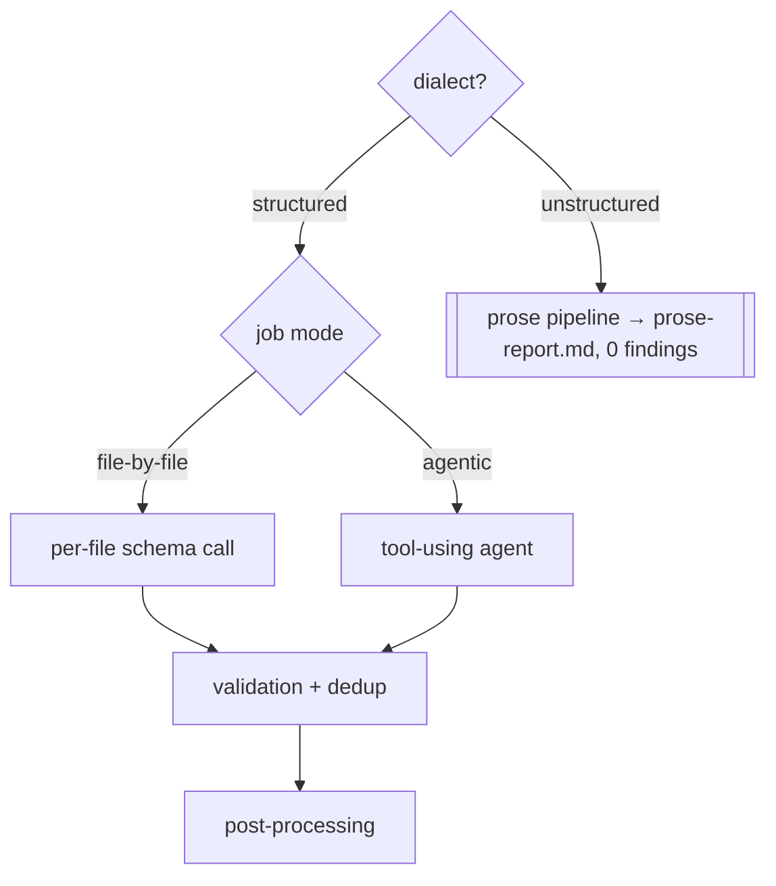

# Spec — Review stage

**Status:** Draft (authored 2026-07-08) — pending spec-readiness-review + human approval · Domain: pipeline · Overview: [README.md](README.md)

The core stage: generates findings from the diff. Dialect routing (structured vs. prose) is specified in [review-dialects.md](review-dialects.md); this spec covers the structured pipeline (jobs/modes), validation/dedup, and post-processing.

## Contract

| | |
|---|---|
| **In** | `analysis.json`; source files; diffs; `review.*` config |
| **Out** | `review-summary.json` — `ReviewMetadata` `{ filesReviewed, issues: Finding[], summary{ totalIssues, critical, high, medium, low, byType{…} }, tokenUsage? }`. Structured runs also dump `issues-before-validation-and-dedup.json` for debugging. |
| **Depends on** | analyze |

⚠ Cleanup: the `projectsReviewed: 0` field and the `GITLAB_CI`-only "injection" type filter (F-15) are vestigial and removed.

## Pipeline & default

The stage runs the configured review pipeline. **Job mode** (structured path): each enabled job is `file-by-file` (default) or `agentic`.

**Default out-of-the-box:** the shipped config enables exactly one job — an **agentic security audit** (`maxTurns 30`; subagents `security-analyzer`, `dependency-tracer`, `breaking-change-detector`; job validation `minConfidence 8`). The `qualopsSelfReview` file-by-file job ships disabled.

### file-by-file
Per pass, files are filtered (globs + content triggers), then each file is reviewed in one schema-constrained call (`temperature 0`) producing `Finding[]`, then validation + deduplication.

### agentic
A tool-using agent (QualOps-owned tools only — [`../integrations/providers.md`](../integrations/providers.md)) investigates the diff across files within a turn/budget cap and returns `Finding[]`, then the same validation + deduplication.
- ⚠ Correction (F-13): the confidence gate uses the **configured** threshold, applied **once**. *(Today a hardcoded `>=7` prefilter runs in the executor in addition to the resolver's configured threshold.)*

### validation & deduplication (both structured modes)
- **Validation:** findings below `minConfidence` are dropped; if a validation prompt is configured, one LLM call removes false positives and may rewrite confidence/severity. *(This self-validation is preserved by the refactor; it is replaced by the independent verifier only in a later functional phase — `concept/02`.)*
- **Deduplication:** findings are grouped by file; files with >1 finding get one LLM call returning the indices to keep.
- ⚠ Correction (F-16): a structured-output parse failure triggers one repair retry and, if still failing, a **visible run notice** — never a silent empty result mistaken for a "clean file."

## Post-processing (all structured modes)

Findings are validated for shape and enriched with `priority`, `estimatedEffort`, and `tags`, then sorted by priority → severity → confidence. Enrichment is single-pass (⚠ F-20: the model's effort estimate is preserved, not overwritten). The unified `Finding` shape and vocabularies: [`../../contracts.md`](../../contracts.md).
