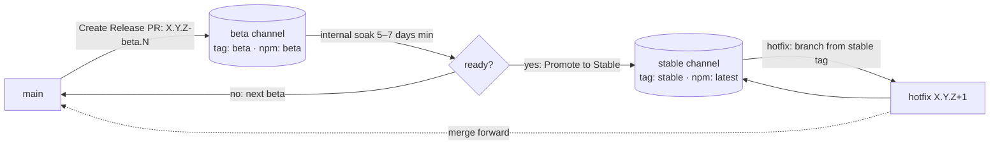

# Spec — Release & Versioning

**Status:** Approved — EggAI, 2026-07-08 · **Owner:** EggAI
**Domain:** operations · **Decision record:** [`../decisions/0001-release-process.md`](../decisions/0001-release-process.md) (rationale & alternatives)

Defines how QualOps is versioned, tagged, and published across its two consumption surfaces. Contract only — the CI workflows that realize it are implementation and are out of scope here.

## 1. Consumption surfaces

| Surface | Reference form | Resolves to |
|---|---|---|
| GitHub Action | `uses: eggai-tech/qualops@<ref>` | a git ref (tag or branch) |
| npm package | `@eggai/qualops` (+ optional `@<dist-tag>`) | an npm dist-tag → a published version |

## 2. Release channels

| Channel | Audience | Git ref | npm dist-tag | Purpose |
|---|---|---|---|---|
| **beta** | internal repos | movable lightweight tag `beta` | `beta` | dogfood pre-release code |
| **stable** | external clients | movable lightweight tag `stable` | `latest` | production-ready releases |

## 3. Versioning scheme (normative)

- **SemVer.** Betas iterate as `X.Y.Z-beta.N` (`0.3.0-beta.1`, `0.3.0-beta.2`, …).
- **Fresh stable version on promotion.** A promoted release publishes a **new `X.Y.Z`** from the *same source commit* as the soaked beta; only `package.json` version and the `CHANGELOG` entry differ. Consumers never end up with a `-beta.N` string in their lockfile.
- **Version tags are immutable forever** (`vX.Y.Z`, `vX.Y.Z-beta.N`).
- **Channel tags are movable** (`beta`, `stable`), force-moved **only** by CI, always with `--force-with-lease` (never `--force`) so racing promotions cannot clobber each other.

## 4. npm dist-tag policy (invariant)

| Publish kind | `npm publish` flag | Writes dist-tag |
|---|---|---|
| prerelease (`-beta.N`) | `--tag beta` | `beta` |
| stable (`X.Y.Z`) | *(none)* | `latest` |

**INV-REL-1:** the npm `latest` dist-tag never points at a prerelease. A prerelease publish must not move `latest`.

## 5. Lifecycle

- **Beta release:** publishes the immutable `vX.Y.Z-beta.N` tag, npm `beta`, a pre-release GitHub Release, and force-moves the `beta` channel tag.
- **Soak:** minimum **5–7 days** for a typical minor release; shorter is acceptable for low-risk patches at maintainer discretion. Soak has value only while a human is actively exercising the beta (⇒ no time-based auto-promotion).
- **Promotion to stable:** validated that the beta exists on npm and carries the `beta` dist-tag; opens a release PR from the beta's exact commit containing only the version bump + changelog move; after merge, publishes `X.Y.Z` to `latest`, force-moves the `stable` tag, and marks the GitHub Release non-prerelease/`latest`.
- **Hotfix:** branch from the `stable` tag, fix, version `X.Y.Z+1`, run the standard release; publishes straight to `latest` and moves `stable`; merge the fix forward to `main` separately.

**INV-REL-2:** moving the `stable` tag + marking the Release `latest` fires on **every** non-prerelease publish (promotion or hotfix), independent of the promotion trigger.

## 6. Governance

- Channel tags (`beta`, `stable`) are moved **only** by the publish/promotion pipelines. Manual movement is disallowed (and documented in `CONTRIBUTING.md`).
- Publish and promotion both route through the `npm` GitHub environment, which requires manual approval.

## 7. Acceptance & verification

| ID | Requirement | Verification |
|---|---|---|
| AC-REL-1 | `latest` never points at a prerelease (INV-REL-1) | publish pipeline selects `--tag` from prerelease detection; asserted before publish |
| AC-REL-2 | Promotion publishes a fresh `X.Y.Z` from the beta's commit | promotion opens a PR from `v$BETA` with only version+changelog diff |
| AC-REL-3 | Channel tags move only via CI, with `--force-with-lease` | branch/tag protection + `npm` environment approval |
| AC-REL-4 | `stable` move + Release `latest` on every stable publish (INV-REL-2) | pipeline job runs on non-prerelease publishes |

## 8. Open items

- **Byte-equivalence caveat:** a promoted stable is byte-equivalent to the soaked beta only if no other PRs landed on `main` during the soak. If `main` moved, the release-PR merge reconciles with its tip and the stable build may include newer commits. Reviewers must diff the promotion PR against `main`; freeze merges during soak if byte-identical promotion is required. *(Recorded, not auto-enforced.)*
- Major-version (`1.0.0`) uses the same model; no separate process.
- Per-PR canary releases: not adopted; revisit only if the soak loop is too slow.
- `stable_version` must share `beta_version`'s base (enforced at input); relax only if cross-version promotion is ever needed.
